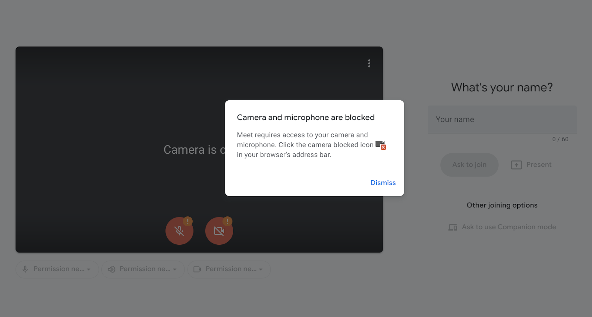

# The < permission > element - Seamless user control of powerful capabilities


## tl;dr
Permissions on the web, despite their success in enabling powerful features, remain a significant source of user annoyance, friction, and abuse, leading to unintended grants as well as unintended denials of critical capabilities. The proposed **`<permission>` element** introduces a clear and consistent interaction pattern for users to control an origin's access to powerful features [1](https://w3c.github.io/permissions/#dfn-powerful-feature). Users' interaction with this element carries with it a **stronger signal of user  intent** than the pre-existing transient user activation, as the user agent controls the element's content and constrains its presentation to promote legibility and comprehension. The intentional nature of this interaction and developers' ability to place it in context gives user agents flexibility to make better decisions about any subsequent browser UI, ultimately reducing frustration for web developers and users alike by making unintentional grants or denials less likely. 


 <div style="display: flex;">
  
  
  
  <p style="margin-top: 5px;"><em>Image 1: The < permission > element introduces a browser-controlled HTML element (with content and styling constraints) (left) that users click with clear intent to trigger such prompts (middle, right).</em> </p>
</div>
 

## Table of Contents
<!-- TOC start -->

- [The Core User Problem](#problem)
- [Solution: The `<permission>` Element](#solution)
- [Goals of The `<permission>` Element](#goals-non-goals)
- [Understanding The `<permission>` Element](#understanding)
- [Technical Specifications](#tech-specs)
- [Designing the Permission UI](#design)
- [Security and Abuse Mitigation](#security-abuse)
   * [Safety Measures](#safety)
   * [Annoyance Mitigation](#annoyance)
   * [Fallbacks When Constraints Are Not Met](#fallback)
- [Developer Integration and Best Practices](#best-practice) 
- [Priming & Pre-Prompts](#priming)
- [Results from the OT](#OT-results)
- [Future of Permissions & Strategic Evolution](#future)
- [Privacy](#privacy)
- [Alternative Considerations](#alternative)
- [Appendix: FAQ Section](#faq)


<!-- TOC end -->

<a name="problem"></a>
<!-- TOC --><a name="problem"></a>
## The Core User Problem

The current implementation of [permissions on the web](https://www.w3.org/TR/permissions/#intro) causes significant problems for users. While permissions are crucial to the web, enabling powerful capabilities (like camera or microphone access) while safeguarding user privacy and security by delegating sensitive decisions to users, this model frequently falters in practice, leading to **frustration and perceived issues for users**.
A prime example is video conferencing, where widespread "microphone not working" issues are often due to permission states rather than technical faults. These problems are compounded by the multi-layered nature of permissions (web origin, user agent, system level) and varying troubleshooting steps across platforms.
A lens through which to view these failures is _false positives_ and _false negatives_: If a user ends up in the state they intended — be it permission granted (true positive) or denied (true negative) — all is well, and the browser has done its job. But if a permission is granted without the user intending it (false positive, e.g., as a result of a "dark pattern" on the page), or if it a permission is denied without intent (false negative, e.g., camera not working in video conference), the browser has failed its user.

| | Camera working on site | Camera not working on site (site or OS permission missing) |
|---|---|---|
| **Intent to use camera on site** | True positive: Intent correctly captured. | False negative: User intended to use camera but permission is blocked (Site/OS) or they changed their mind. Solution: Clear intent by clicking the `<permission>` element to show the prompt again. |
| **No intent to use camera on site** | False positive: Permission granted without user intent. Solution: `<permission>` element requires explicit user click on clearly labeled button to show prompt. | True negative: Intent correctly captured. |


Users frequently encounter several challenges with current permission models:
- **Limited Impact of Existing Mitigations:** Current spam and abuse mitigation approaches have an architectural upper bound on user protection because the model relies on the website to choose when to trigger the prompt rather than capturing a reliable signal of user intent. This is evident in metrics where most user interactions on permission prompts are negative.
- **Contextual Blindness:** User agents currently lack semantic understanding of events in the content area prior to a permission request, limiting their ability to provide better, more contextual prompts. This often leads to prompts that can "come out of nowhere," correlated poorly with user expectations.
- **Difficulty in Recovery from Denials:** While existing "permanent deny" policies on site or OS level reduce spam, they make it difficult for users to change their minds later, requiring them to navigate complex browser or system settings. This backfires when a user genuinely wants to re-enable a feature but struggles to do so, leading to a worse experience.

<table style="width: 100%; border: none;">
  <tr style="border: none;">
    <td style="width: 40%; text-align: center; border: none;"> 
    </td>
   <td style="width: 20%; border: none;"> &nbsp;&nbsp;&nbsp;&nbsp;&nbsp;&nbsp;&nbsp;&nbsp;&nbsp; </td>
    <td style="width: 40%; text-align: center; border: none;"> 
    </td>
  </tr>
</table>
<p> <em>Image 2: These images illustrate a common user challenge: previously denied permissions. On the left, a user had blocked camera and microphone access, but now clearly intends to re-enable them by clicking an "unmute" button. Similarly, the right shows a user who had denied location access, but now expresses strong intent to use it by clicking a "use my current location" button. In both cases, because the user agent lacks insight into these in-content interactions, it's compelled to respect the previous denial. This leaves users struggling to navigate complex browser or OS settings, especially in stressful scenarios like an important presentation or finding a nearby store.</em> </p>

- **Accessibility Challenges with Current Approaches:** Current JavaScript-triggered permission UIs can present issues for screen readers and magnification users. Native HTML elements like the `<permission>` element are accessible by default.
 
Therefore, a more confident signal of user intent is key to making web permissions work better for users, which the `<permission>` element aims to achieve.

<!-- TOC --><a name="solution"></a>
## Solution: The `<permission>` Element

The semantic `<permission>` HTML element will serve as an in-content entry point for permission requests, appearing and functioning much like any other HTML button [Image A]. The crucial difference is that a click on this button will trigger a permission request for which the user agent can have high confidence that it was user-initiated [Image C]. To achieve a strong signal of user intent, user agents require [user activation](https://developer.mozilla.org/en-US/docs/Web/Security/User_activation) to let a script trigger a permission prompt.

The `<permission>` element comes with browser-controlled content and styling constraints to prevent manipulation and ensure its integrity. This design unifies permission control by offering a clear, consistent, in-page access point for managing permissions in both the browser and the OS.

User agents can combine the element with a louder, more opinionated design to emphasize the critical decision moment. Other user agents can tailor this experience to their needs while relying on the strong user signal the element provides. For instance, Chrome is doing an implementation that combines this semantic HTML element [Image A] with a full-page modal confirmation UI [Image B,C] that applies a scrim to obscure underlying site content during the critical decision moment. Regardless of the specifics, the `<permission>` element makes manipulation and "change blindness" more difficult. Browsers maintain strict control over the content presented to the user, ensuring it aligns with their understanding of user intent. This approach significantly enhances user intent capture, improving accessibility, security, and user-friendliness for both users and developers. The element also includes appropriate safeguards to protect users from common spam and abuse patterns such as clickjacking.


<table style="width: 100%; border: none;">
  <tr style="border: none;">
    <td style="width: 60%; text-align: center; border: none;"> 
    </td>
    <td style="width: 10%; border: none;"> &nbsp; </td>
    <td style="width: 30%; text-align: center; border: none;"> 
    </td>
  </tr>
</table>
<p> <em>Image 3: Implementation example: A video conferencing site providing a "Use microfone" button and a search site a "Use precise location" button, that triggers a microfone or geolocation permission request. </em> </p>


<!-- TOC --><a name="goals-non-goals"></a>
## Goals of The `<permission>` Element

The primary goals of the `<permission>` element are:
- More Confident and Robust Capture of User Intent: The element's design provides a strong signal of user intent, allowing user agents to make more informed decisions about presenting permission requests. This is achieved by requiring a user click on a dedicated button with an actionable message (e.g., 'use camera') in context and at the time of need, providing a more accurate capture of intentionality compared to general user gestures or mere page loads.
- Reducing False Positives and False Negatives: The `<permission>` element specifically aims to reduce both false positives (unintended grants) and false negatives (unintended blocks), thereby driving down the number of prompts users encounter. 
- Mitigating OS-level and Site-level Permission Regret: A significant user problem is regretting a denial, especially when it's persistent or at the OS level, making it hard to revert. The `<permission>` element provides a clear, consistent way for users to revisit and manage their permission decisions upon clear intent, facilitating necessary changes when user intent evolves
- Better Context: The `<permission>` element allows developers to integrate permission requests into the user journey at the UX design stage, ensuring clearer context for the user. The affordance to grant permission is in-context, making it easier for legitimate use cases to explain what is being asked and why.

<!-- TOC --><a name="understanding"></a>
## Understanding the `<permission>` element

The `<permission>` element is designed to be straightforward for developers to integrate into web pages like any regular button while offering robust browser control for security and user experience. For example:

```html
<style>
  permission {
    background-color: lightgray;
    color: black;
    border-radius: 10px;
  }
</style>
<permission type="geolocation"></permission>
```


<!-- TOC --><a name="tech-specs"></a>
## Technical Specification
- **Parsing Model**: The `<permission>` element's contents will be ignored by default and instead the user agent will render its own contents. This ensures its content and appearance are strictly controlled by the user agent.
- **Attributes**: The element supports several attributes to define its behavior:
  - `type`: Specifies which permission the element applies to (e.g., "microphone", "geolocation", "camera"). It can also be a space-separated list for grouped permissions if the user agent supports such grouping (e.g., microphone and camera requests are commonly grouped).
preciselocation: A boolean (true/false) specific to the geolocation permission type.
  - `sysex`: A boolean (true/false) specific to the MIDI permission type.
  - `pantiltzoom`: A boolean (true/false) specific to the camera permission type.
  - `lang`: The global lang attribute has a specific purpose here. Since the element's content is set by the user agent, this attribute indicates the desired language for the text. The user agent will attempt to provide the text in that language if possible. Note that this only determines the language of the HTML element, not the permission confirmation UI itself, which will use the user agent's primary language settings.
- **CSS Pseudo-classes**:
  - `:granted:` This pseudo-class is applied when the relevant permission is granted (either previously or during the current session). Sites can style the `<permission>` element differently in this state (e.g., to indicate "Location shared").
- **Fallback contents**:
The `<permission>` element’s contents can be used as a fallback in case the user agent does not support the `<permission>` element. User agents that support the `<permission>` element will ignore the contents and instead render its own. There is one exception to this: if the provided `type` attribute value is not supported, the browser will stop providing its own content and instead use the site-provided fallback content inside the `<permission>` element (if it exists).


<!-- TOC --><a name="design"></a>
## Designing The Permission UI

After a user clicks the `<permission>` element, a browser-controlled confirmation UI is presented to confirm their decision and potentially allow configuration. User agents have flexibility in designing this UI, but certain considerations apply:
- **Standard UI**: Since the user agent has a strong signal of the user's intent and current focus, it can use this to improve the general UX without risking interrupting the user. This confirmation UI can make use of the `<permission>` element's position on the page to position itself on the screen. It can also be brought more into attention by the user agent, for instance, by applying a gray filter over the site content area. The confirmation UI should also have an obvious way for the user to change their mind.


- **UI for Administrator-Blocked Permissions:** There are many user agents that offer mechanisms for permission granting that involve some sort of administrator or management system, which the user cannot override. In such scenarios, the `<permission>` element text itself should not change (as it can be used as a potential fingerprinting bit). Instead, the confirmation UI should clearly communicate this situation to the user (e.g., "Your administrator has blocked camera on example.com").


- **UI When Permission is Already Granted*:* When the permission is already granted and the user clicks the `<permission>` element, a traditional permission prompt does not make much sense. Instead, the UI can be used for other reasonable purposes, such as allowing the user to easily change their previous decision (e.g., "You have allowed camera on example.com," with options to "Continue allowing" or "Don't allow camera"). While the primary goal of The `<permission>` element is not to encourage sites to revert previously granted permissions, its design includes defined behavior for such cases for completeness. This capability could offer potential incentives for sites, such as enhancing site reputation and trust by demonstrating commitment to user privacy and control, boosting user engagement and retention by reducing frustration, and even increasing initial grant rates if users know they can easily revert later.


- **UI When Request is Otherwise Blocked:** User agents implement many mechanisms to prevent permission requests, such as permanent denies (explicit or implicit), duration-based denies, heuristics, blocklists, or ML-based automatic blocks. Each of these mechanisms should be carefully weighed against the strong signal sent by the user clicking the `<permission>` element. This strong signal might override some of these mechanisms entirely (e.g., heuristics or ML models might not apply to `<permission>` element-triggered prompts) or lead to a compromise. For example, if a site is in a "deny" state but the user clicks the `<permission>` element, the confirmation UI could appear as: "You previously didn't allow camera on example.com" with options like "Continue not allowing" and "Allow once”. In such a case, offering "Allow once" instead of a permanent "Allow" is a deliberate choice to be on the safe side, given the user previously denied the permission. If the user then clicks the `<permission>` element again on the next visit, they would see the standard browser prompt for a full "Allow" decision.


- **Flexibility and Future UI Considerations:** The `<permission>` element proposal does not prescribe any particular prompt UI or exact text to browsers. This flexibility allows user agents to optimize their native prompt display for specific platforms and user expectations, including handling internationalization and cultural differences, a task browsers already manage for existing prompts. Despite these UI and linguistic variations, the `<permission>` element ensures consistent, browser-controlled content and semantic meaning during the critical decision moment. Future considerations for The `<permission>` element's visual design include evolving from text-only (status quo) to 'Icon + Text' and potentially 'Icon only' displays. It's noted that in-call controls are not a primary use case for the `<permission>` element in the near future. For certain low-risk capabilities, a future design evolution could allow skipping the secondary confirmation UI entirely, while high-risk capabilities like camera and microphone would retain it. Recognizing that embedding the `<permission>` element within UI increases design challenges, including potential layout issues arising from browser variations, the proposal aims for a consistent semantic meaning and user intent capture rather than dictating a uniform device-independent UI across all browsers.
  
- **Browser UI vs. Site UI Distinction:** A common pattern is to show centered permission prompts, such UI can be highly disruptive if the user is not expecting or initiating it. Moving a prompt to the center of the page without a clear, user-initiated intent, but rather developer initiated risks giving users the feeling they are being forced to make a decision. The goal of the `<permission>` element is for users to achieve their desired outcome with only relevant permission prompts. The `<permission>` element ensures the permission decision UI itself remains under strict browser control, preventing manipulative or misleading framing within the prompt. However, it's also acknowledged that the distinction between browser UI and site UI might not matter as much to users as it does to browser engineers.


<!-- TOC --><a name="security-abuse"></a>
## Security and Abuse Mitigation
The goal of user agents is to ensure that the `<permission>` element is not trivial to abuse. This involves addressing two primary types of abuse: safety (preventing unintended grants via manipulative UIs) and user annoyance (preventing repeated, unwanted prompts). These are addressed by the "Confirmation UI" and by constraints on the `<permission>` element respectively.

<!-- TOC --><a name="safety"></a>
### Security and Abuse Mitigation
The safety of the `<permission>` element hinges on the presence of a browser-generated "Confirmation UI" that confirms the user's decision to grant the permission. This UI is strictly better than existing non-modal permission prompts implemented by most browsers because it:
- Is generated by the browser, with the only inputs accepted from the website being the requested permission types.
- Is modal, requiring explicit dismissal or decision for the user journey to continue.
- Obscures website content with a semi-opaque and blurred scrim, preventing the site from manipulating the user's decision-making or obfuscating the modal content.
These strict constraints make the `<permission>` element minimally as safe (and arguably safer) than existing non-modal UI.

<!-- TOC --><a name="annoyance"></a>
### Annoyance Mitigation
Mitigating annoyance by ensuring user intent is more complex than ensuring safety, but equally important. Without mitigating annoyance, it wouldn't be reasonable to impose the safer, but more disruptive, modal confirmation UI. Sites could use techniques to annoy users by repeatedly triggering modals. The `<permission>` element handles this through:
- **Browser-Controlled Text:** The text on the `<permission>` element cannot be set by the site. Instead, the user agent sets it to something comprehensive (e.g., "Use location" for geolocation), preventing misleading text like "Click here to proceed".
- **Strict Styling Constraints:** The style of the `<permission>` element is verified, validated, and overridden by the user agent as needed. This prevents obscuring the element's purpose (e.g., by setting the same text and button colors). The following CSS properties have special rules applied to them:
  - `color`, `background-color`: Must have a contrast ratio of at least 3 for legible text; alpha must be 1.
  - `font-size`, `zoom`: Must be within the equivalent of 'small' and 'xxxlarge'.
  - `border-width`: Values over 1em are corrected to 1em.
  - `outline-offset`: Negative values are corrected to 0.
  - `margin (all)`: Values under 4px are corrected to 4px to help prevent false positives for occlusion detection.
  - `font-weight`: Values under 200 are corrected to 200.
  - `font-style`: Values other than 'normal' and 'italic' are corrected to 'normal'.
  - `word-spacing`: Values over 0.5em are corrected to 0.5em; values under 0 are corrected to 0.
  - `display`: Values other than 'inline-block' and 'none' are corrected to 'inline-block'.
  - `letter-spacing`: Values over 0.2em are corrected to 0.2em; values under -0.05em are corrected to -0.05em.
  - `min-height`: Defaults to 1em, taking the maximum of default and provided values.
  - `max-height`: Defaults to 3em, taking the minimum of default and provided values.
  - `min-width`: Defaults to 'fit-content', taking the maximum of default and provided values.
  - `max-width`: Defaults to 3*'fit-content', taking the minimum, with exceptions for elements with a border meeting specific criteria.
  - `padding-top`: Takes effect only if height is 'auto'; values over 1em are corrected to 1em, and padding-bottom is set to padding-top's value.
  - `padding-left`: Takes effect only if width is 'auto'; values over 5em are corrected to 5em, and padding-right is set to padding-left's value, with exceptions for elements with a border.
  - `cursor:` Defaults to 'pointer'; 'not-allowed' is also valid, others are corrected to 'pointer'.
- **Occlusion Detection:** The user agent verifies that the `<permission>` element has been visible for a short time (e.g., 500ms) before a click is registered. User agents implementing IntersectionObserverV2 can leverage it internally for this.
- **Movement Detection:** The user agent ensures the `<permission>` element has not been recently moved (e.g., in the past 500ms) to prevent sites from moving it under the user's cursor to trick them into clicking.
- **Recent DOM Insertion Detection:** Similarly, the user agent ensures the `<permission>` element has not been recently inserted into the DOM (e.g., in the past 500ms).
- **Element Quantity Limit:** To prevent sites from "tile-covering" their content with `<permission>` elements, there is a limit of at most two `<permission>` elements per permission type, per page.
- **Subframe Usage Conditions:** While usage in subframes is allowed, several security constraints are enforced to prevent clickjacking attacks where a malicious site embeds a legitimate site that uses a `<permission>` element:
  - Permission Policy must first allow the permission in the subframe.
  - The frame-ancestors Content Security Policy (CSP) directive must be explicitly declared if a document using the `<permission>` element is embedded cross-origin (to the top-level frame). This ensures permissions cannot be obtained by a bad actor via an embedded site without explicit opt-in.
- **Synthetic Click Events Ignored:** Click events which are simulated by the site (e.g., via the click() JavaScript function) are not considered valid user-initiated interactions. This ensures genuine user intent for triggering the permission flow.

<!-- TOC --><a name="fallback"></a>
### Fallbacks When Constraints Are Not Met
If the integrity of the `<permission>` element click is not assured (e.g., due to styling issues, occlusion, or recent movement), user agents have several approaches to consider:
- **Trigger Legacy Flow**: The click could trigger the equivalent JavaScript API's legacy permission flow (as if it was triggered by the equivalent JS API). This is suitable for non-self-correcting issues like styling problems or occlusion.
- **Do Nothing**: The click could simply do nothing. This is appropriate if the failing check will self-correct (e.g., after a short cooldown if the element has recently moved).

<!-- TOC --><a name="best-practice"></a>
## Developer Integration and Best Practices
The `<permission>` element is designed to integrate smoothly with existing web platform APIs and developer workflows.
- **Responding to Permission Status Changes:** Developers should use the Permissions API in parallel with the `<permission>` element. This ensures the site responds to all permission status changes, including those not directly caused by interaction with the `<permission>` element (for example, user agents generally allow users to control permissions on various UI surfaces that are entirely separate from the site's rendering area).
- **Event Handlers:** Specific event handlers are available on the `<permission>` element:
  - `onpromptdismiss`: Fired when the permission UI triggered by the `<permission>` element has been dismissed by the user (for example via clicking the 'x' button or clicking outside the prompt). Sites can use this to provide additional context to potentially help the user make a decision.
  - `onpromptaction`: Fired when the permission UI triggered by the `<permission>` element has been resolved by the user taking some action on the prompt itself. Note that this does not necessarily mean the permission state has changed; the user might have taken an action that maintains the status quo.
  - `onvalidationstatuschange`: Fired when the `<permission>` element switches from being "valid" to "invalid". The element is considered "valid" when the user agent trusts the integrity of the signal if the user were to click on it, and "invalid" otherwise.
   - The `isValid` boolean attribute indicates whether the status has transitioned to "valid" or not.
   - The `invalidReason` string attribute provides the reason why the status is "invalid" (or "" if it's valid), and can be one of the following values:
     - "recently_attached": the element has just been attached to the DOM.
     - "type_invalid": the type attribute does not have a supported value.
     - "illegal_subframe": conditions for usage in a subframe are not met.
     - "unsuccessful_registration": the allowed limit of permission elements is exceeded.
     - "intersection_changed": the element has recently moved (either by layout changes or scrolling).
     - "intersection_out_of_viewport_or_clipped": the element is not currently fully in the viewport of its frame.
     - "intersection_occluded_or_distorted": the element is currently covered by some other element.
     - "style_invalid": the element's style does not pass validation. Developers should handle this event to future-proof their websites against unexpected changes in browser validation criteria.
    
 Example usage:

```html
<style>
  permission {
    background-color: blue;
    color: white;
    border-radius: 10px;
  }
</style>

<permission
  onpromptdismiss="showContextInfo()"
  type="microphone"
></permission>

<script>
  function showContextInfo() {
    // Provide some additional information since the     .
    // user has just dismissed the permission prompt     .
    // without making a decision.
  }
  navigator.permissions
    .query({ name: 'microphone' })
    .then((permissionStatus) => {
      permissionStatus.onchange = () => {
        // Run the check when the status changes.
        if (permissionStatus.state === 'granted') startUsingMic();
      };
      // Run the initial check.
      if (permissionStatus.state === 'granted') startUsingMic();
    });
</script>
```


- **Fallback Solutions:** For browsers that do not support the `<permission>` element, developers can implement straightforward fallback solutions. In many cases, the `<permission>` element can augment existing permission journeys, so a polyfill may not be strictly necessary. When the `<permission>` element replaces existing journeys, polyfills are typically simple, often involving a standard HTML button that links to capability usage. User experience testing has shown that the `<permission>` element significantly outperforms other permission request flows in terms of user and developer preferred outcomes (lower decision "regret", whether granted or blocked), and a much higher success rate of users reverting past decisions they regretted, making its adoption appealing even with fallback considerations.
  While fallback mechanisms may introduce some initial code duplication or additional layers of complexity for developers supporting unsupported browsers, we believe this is surmountable given the significant user and developer experience advantages of the `<permission>` element.
The `<permission>` element is designed to degrade gracefully and provide a fallback experience.
- **Shift in Effort/Burden:** The `<permission>` element represents a strategic shift in effort. 
    
    | | User Experience / Effort | Developer Effort | User Agent Effort |
    |---|---|---|---|
    | **Status Quo** | High Frustration / High Burden: Users are often overwhelmed by a "noisy web" (out-of-context prompts), leading to decision fatigue. Recovering from past denials (site or OS level) is cumbersome and difficult. | Low-Medium Effort: Requesting prompts on page load is relatively easy, with little initial thought often given to user context. However, well-behaved sites face significant effort to guide users through external permission/OS settings when access is previously blocked. | Low Effort: Primarily asks users to make permission decisions via prompts. May implement some heuristics to try and prevent/silence unwanted prompts. |
    | **With the `<permission>` element** | Empowered / Low Burden: Users trigger permission prompts in the right context and at the right time, leading to a more intuitive experience. | Medium-High Effort: Developers need to thoughtfully consider the user journey and strategically place the `<permission>` button within their site's design. | High Effort: The User Agent takes on significant complexity by managing robust security measures, styling constraints, timing, and position mitigation for the element. |
    
    Under the status quo, users bear a high burden due to a 'noisy web,' decision fatigue from out-of-context prompts, and cumbersome recovery from past denies at site or OS level. Developers, while having low-to-medium effort in requesting prompts on page load, face significant effort in helping users navigate browser settings for troubleshooting. The User Agent has low effort, simply asking users to make decisions. With the `<permission>` element, the user's burden becomes low, as prompts are triggered in the right context and timing. Developers take on a medium-to-high effort, needing to thoughtfully integrate the `<permission>` button into user journeys. Crucially, the User Agent's effort becomes high due to the added complexity of security measures, styling constraints, timing, and position mitigations. Currently, well-behaved websites face a significant burden, often needing to guide users through complex, often outdated, and User Agent-specific explanations in pop-ups to troubleshoot permission settings. 
    
    
    This burden is exacerbated because developers often don't know the exact source of a permission error. The `<permission>` element can significantly reduce these types of troubleshooting prompts. Furthermore, The `<permission>` element drastically simplifies recovery from OS-level blocks: a process that can involve more than 12 steps for users in macOS and often leads to a dead end without it, is reduced to 6 steps with the `<permission>` element.


 - **Implementor Portability, Internationalization & Upkeep:** Ensuring the `<permission>` element remains effective across various languages, cultures, and browser versions presents ongoing challenges related to internationalization, maintenance, and portability. While continuous updates and maintenance will be required, potentially leading to usability issues if sites cannot account for future browser changes, the `<permission>` element leverages existing browser capabilities. Browsers already manage internationalization and cultural differences for their existing prompts. Most browsers already have user-recognizable iconography for common permissions such as Camera/Microphone or Location and the `<permission>` element can share strings used in the existing permission journey. The proposal does not prescribe any particular prompt UI or exact text, allowing browsers to optimize their native display for specific platforms and user expectations. The element's robust validation system and events (like onvalidationstatuschange) are designed to provide developers with the necessary signals to adapt and future-proof their websites.

<!-- TOC --><a name="priming"></a>
## Priming & Pre-Prompts
The `<permission>` element fundamentally shifts control to the user, as websites cannot proactively request permissions via the `<permission>` element; only the user can initiate the permission flow. The element's button strings, such as "use <capability>" rather than "allow <capability>," implicitly signal an immediate action, inherently discouraging sites from asking significantly in advance of actual use.

**For Well-Behaved Sites:**
- **Ask Ahead of Usage:** For some real-time capabilities, such as camera or microphone access in video conferencing, users often prefer to handle permissions setup proactively to avoid interruptions shortly before or during a call. Developers displaying pre-prompts for these capabilities are often responding to the nature of the real-time interaction itself. For example, multiple conferencing sites already had pre-prompts related to mic/camera permissions before implementing the `<permission>` element during the origin trial. The `<permission>` element does not prevent or eliminate existing pre-prompts, as they serve to build context for the users’ benefit.

<table style="width: 100%; border: none;">
  <tr style="border: none;">
    <td style="width: 40%; text-align: center; border: none;"> 
    </td>
   <td style="width: 20%; border: none;"> &nbsp;&nbsp;&nbsp;&nbsp;&nbsp;&nbsp;&nbsp;&nbsp;&nbsp; </td>
    <td style="width: 40%; text-align: center; border: none;"> 
    </td>
  </tr>
</table>
<p> <em>Image 4: Priming example of meet.com in Firefox (left) and Zoom.com in Chrome (right) without the < permission > element. </em> </p>


<table style="width: 100%; border: none;">
  <tr style="border: none;">
    <td style="width: 40%; text-align: center; border: none;"> 
    </td>
   <td style="width: 20%; border: none;"> &nbsp;&nbsp;&nbsp;&nbsp;&nbsp;&nbsp;&nbsp;&nbsp;&nbsp; </td>
    <td style="width: 40%; text-align: center; border: none;"> 
    </td>
  </tr>
</table>
<p> <em>Image 5: Priming example of zoom.com  with the < permission > element (left) and meet.com with the confirmation UI after clicking the < permission > element in Chrome (right). </em> </p>
 
- **Ask at Time of Usage:** In contrast, for capabilities like geolocation, the expected user experience is typically "user-pull". Sites commonly employ in-page buttons such as "locate me" or integrate a location chooser, which users interact with to explicitly trigger a request. The `<permission>` element enshrines these existing UX patterns, allowing the permission to be requested when the user explicitly indicates intent, rather than being shown as an unsolicited pre-prompt.

<table style="width: 100%; border: none;">
  <tr style="border: none;">
    <td style="width: 40%; text-align: center; border: none;"> 
    </td>
   <td style="width: 20%; border: none;"> &nbsp;&nbsp;&nbsp;&nbsp;&nbsp;&nbsp;&nbsp;&nbsp;&nbsp; </td>
    <td style="width: 40%; text-align: center; border: none;"> 
    </td>
  </tr>
</table>
<p> <em>Image 5:  In-page button to use location in target.com (left) and ups.com (right) which can be replaced by a < permission > element button. </em> </p>

- **Context Building & Reducing Existing Prompts:** Preparing users for permission requests is not inherently detrimental; providing contextual information is encouraged, and the `<permission>` element facilitates a standardized approach. Peer-reviewed research ([1](https://dl.acm.org/doi/10.1145/3706598.3713547),[2](https://dl.acm.org/doi/fullHtml/10.1145/3613904.3642252#sec-29))  highlights that providing sufficient context and enabling users to perceive a personal benefit is strongly associated with granting permissions. This underscores that well-timed and contextualized requests are central to successful capability use. Similarly, sites leveraging helpful pre-prompting patterns are more likely to have higher grant rates.
  
The `<permission>` element can also reduce priming. Currently, sites use pre-prompts to build context and clarity for users. With the `<permission>` element, sites can dare to get away without a pre-prompt, as the consequences are less severe. This is because the `<permission>` element doesn’t require a permanent block option and it offers users a clear path to safely and easily revisit decisions within the same session. This lowers the risk of accidental denials that might otherwise occur without a pre-prompt. This also helps well-behaved sites reduce the burden of guiding users through complex, often outdated, and UA-specific troubleshooting explanations. Furthermore, for well-intended sites that might accidentally prompt on load by directly calling a protected API without building sufficient context, the existence of the `<permission>` element offers signposting that there is a better solution. While this might lead to additional pre-prompts from these developers as they adopt better practices, it ultimately represents a net gain for users.


<table style="width: 100%; border: none;">
  <tr style="border: none;">
    <td style="width: 30%; text-align: center; border: none;">  </td>
   <td style="width: 5%; border: none;"> &nbsp;</td>
    <td style="width: 30%; text-align: center; border: none;">  </td>
   <td style="width: 5%; border: none;"> &nbsp;</td>
    <td style="width: 30%; text-align: center; border: none;">  </td>
  </tr>
</table>
<p> <em>Image 6:  Meet.com guiding users through Firefox settings (left), Safari settings (middle) and Google Search guiding users through Chrome Settings (right). </em> </p>


**For Abusive Sites:**
- Existing Behavior: Abusive sites are already excessively prompting and pre-prompting regardless of the existence of the permission element. If users enter a persistent block state, those sites simply navigate users to a new domain in order to be able to re-prompt the user. The `<permission>` element's goal is not to solve this specific problem.
- Increased Difficulty for Manipulation: However, since the `<permission>` element requires and restricts the string to ensure clear understanding (e.g., "use camera"), it would make it harder to trick users to trigger a permission prompt compared to being able to just call a JavaScript API on page load. 

Preventing sites from unnecessary and potentially annoying pre-prompting remains practically infeasible. Therefore, The `<permission>` element prioritizes a consistent, user-centric permission experience, regardless of pre-prompting, ultimately empowering users with greater clarity and control. The overall expectation is that priming frequency remains roughly the same or decreases.

<!-- TOC --><a name="OT-results"></a>
## Results from the OT
During the origin trials, the `< permission > `element demonstrated significant improvements in user experience. For instance, Google Meet saw a 137% increase in permission recovery rates. Google Search saw a 17-36 percentage point increase in successfully adjusting location settings on desktop and mobile respectively.


<!-- TOC --><a name="future"></a>
The `<permission>` element is a crucial first step toward improving web permissions. While it does not directly address all inherent issues with existing APIs (such that those problems remain in the platform), it offers a concrete, harder-to-game alternative with real user experience benefits. We advocate collaborating on evolutionary approaches to enhance the existing permission request model of the web, addressing permission spam issues in specific APIs (like Notifications and Geolocation) and exploring enhancements to HTML's user activation model, ideally in parallel with this proposal's development. The `<permission>` element distinguishes itself not merely as a new API, but as a mechanism that fundamentally redefines the signal of user intent. It provides a robust, browser-controlled entry point that was previously lacking, enabling the improved user experience and security benefits outlined.

And while it doesn't immediately solve all issues with malicious actors abusing existing APIs like getUserMedia() (and it is not the goal) it offers genuine utility for well-behaved sites today.

This foundational element sets the stage for future, more significant changes to how existing API behaviors are handled. Modifying core API behavior is a massive undertaking, and better alternatives like the `<permission>` element need to be in place first to ensure a smooth, collaborative transition.

This is particularly relevant for concepts like transient user activation. While we agree with the principle of user activation for permission requests, (providing a (weak) signal that the user at least interacted with the page at all), simply requiring activation is insufficient to guarantee the prompt will be shown in a moment that is helpful for users. User activation is easily gamed, as any unrelated scrolling or clicking already allows showing a permission prompt. Developers need a better pattern to provide context for permission requests. The `<permission>` element offers this solution now – a declarative, browser-controlled way to display the permission prompt into relevant context on well-behaved sites. User initiation encourages that:

- The user understands the purpose of the permission, or at least has enough context to feel comfortable engaging in an activity that uses this permission. And if not, it’s likely that they just won’t click a button that says “Use <capability>”.
- The user's current flow or task is related to granting this permission and as such it's unlikely that the permission request could be interruptive. And if it is interrupting, it’s likely that they just won’t click a button that says “Use <capability>”.
- The user agent can ensure the subsequent UI is placed near the current focus of attention of the user, as the user has just interacted with some piece of UI to request permission, meaning their focus is likely in that area.

While user gestures can be easily gamed by manipulative or malicious websites, the `<permission>` element aims to provide a more robust signal of user intent.

### Future Considerations
- **Expanding Capability Support:** Other capabilities will be evaluated in terms of their ability to capture user intent confidently and their abuse potential.
- **UI Evolution:** The design may evolve in the future to cover more use cases as they arise, meeting developer needs, potentially including icon-only displays or skipping the secondary confirmation UI for certain situations. For example, low risk capabilities could skip the confirmation UI (secondary UI) (e.g. sharing a single set of coordinates" or "clipboard read), while high-risk capabilities like camera and microphone would retain it.
- **Integration with App Settings:** For installable web apps, user agents already offer enhanced features like the ability to "Run on OS Login." In the future, the `<permission>` element could be leveraged to provide web apps with a standardized way to embed and manage relevant app-specific settings directly within their own "Settings" page. This would function similarly to how native applications expose their settings, offering users a centralized and familiar point of control. Ultimately, this integration would give users a better feeling of control over an app and build trust by making it easier to change permission states (e.g., from "Allow" to "Block") for various features, all within the context of the web app itself.

<!-- TOC --><a name="privacy"></a>
## Privacy
Extreme care needs to be taken to ensure that information exposed by the `<permission>` element is limited to what a site needs to know. Information that can already be determined (for example via the Permissions API) is fine to be exposed via the `<permission>` element. Other sensitive information should not be.

For instance, many user agents provide a way for an administrator to manage certain permissions on behalf of the user. In such cases, the user agent might decide to have the `<permission>` element text reflect this state, perhaps by setting the `<permission>` element text to "Admin blocked". However, this would provide information to the site that they would otherwise not be privy to, namely that the user's settings are partially controlled by an administrator. Such sensitive information should be avoided to prevent potential fingerprinting.


<!-- TOC --><a name="alternative"></a>
## Alternative Considerations
Before proposing the `<permission>`  element, we thoroughly evaluated several alternative approaches to address the persistent challenges in web permissions. Each alternative was considered for its potential to improve user experience and security, but ultimately presented limitations that led to the current proposal.

### 1. No Platform Changes
One option was to simply encourage developers to adopt current best practices by using existing HTML buttons and JavaScript APIs to trigger permission requests. This would involve promoting patterns through articles and communications.
- Disadvantages: This approach offers no signal or guarantee of the user's intent to the user agent, meaning browsers would remain defensive against permission abuse. It also places the full burden of user experience design on the site, leading to potential inconsistencies and suboptimal experiences, especially for resource-constrained development teams.

### 2. Improving Existing Usage-Triggered Permission Request Journeys
We considered improving the existing model where permission requests are triggered directly by the use of a capability (e.g., `getUserMedia()` triggering a camera permission). While improvements to this journey are always possible and are intended to be explored in parallel, there are inherent limitations.
- **Disadvantages:**
  - **Accessibility:** Native HTML elements, like the proposed `<permission>`  element, are accessible by default, offering built-in roles and keyboard interactions. While JavaScript solutions can be made accessible, this requires additional developer effort.
  - **User Intent:** JavaScript-triggered UI cannot reliably capture user intent in the same robust way as the `<permission>`  element, as user gestures are easily gamed by malicious sites.
  - **Context:** While sites can provide context, the `<permission>`  element ensures consistent context through its browser-controlled UI and labels.
  - **Reconsideration:** It's difficult for browsers to safely allow users to reconsider past permission denials with usage-driven UI, as it could enable spammy behavior. Guiding users through complex browser or OS settings for reconsideration places a significant, often unsuccessful, burden on developers and users.

### 3. Separating the Proposal (Intent Signal vs. UI Improvements)
An alternative was to split this proposal into two: one for improving the user intent signal and another for permission prompt UI improvements.
- **Disadvantages:** The UI improvements are integral to understanding the full benefits of a strong user intent signal. Visualizing how user agents can act on this signal is necessary to evaluate the overall usefulness of the proposal, even without prescribing specific UI models.

### 4. Extending an Existing HTML Element
Instead of a new element, existing HTML elements like <input type="button"> or <button> could be augmented with new attributes (e.g., permission-type="geolocation").
This could be an example of how this would look like:

```html
<p>
  Button:
  <button permission-type="geolocation"></button>
</p>

<p>
  Input:
  <input type="permission-control" permission-type="geolocation" />
</p>

<style>
  button[permission-type],
  input[permission-type] {
    background-color: white;
    color: blue;
  }
</style>
```


- **Disadvantages:**
  - **Backwards Compatibility & Interoperability:** Older browsers or those not implementing the new attributes would render a non-functional button, leading to a worse user experience unless complex polyfills are used.
  - **Counter-intuitive Behavior:** Existing elements like button offer extensive developer control over text and styling. Introducing severe browser-controlled restrictions for permission purposes would make their behavior inconsistent and counter-intuitive compared to their standard use cases, justifying a distinct element.
  - **Flexibility (for button):** While the current proposal envisions a button-like element, future needs might involve other UI types (checkbox, link), which a new element can more flexibly accommodate.
  - **Semantic Mismatch (for input):** The input element is primarily for data entry within forms. Adding a permission-specific type would be a poor design fit due to the lack of connection between permissions and form data.

### 5. Providing a JavaScript API for Element Registration
Another option involved a JavaScript API to register an existing HTML element (e.g., a simple button) as the permission control point.
```html
<button id="pepc">Share location</button>

<script>
  pepc_params = {};
  pepc_params['type'] = 'geolocation';
  navigator.permissions.registerPEPC(
    document.getElementById('pepc'),
    pepc_params,
  );
</script>
```
- **Disadvantages:**
  - This approach doesn't inherently bring permissions into the interaction design process; it remains an implementation detail.
  - Dynamically selecting the element complicates security verification and constraints, making it less robust than a dedicated element.
  - Requires manual developer handling for unsupported browsers, as a non-functional button would otherwise be present.
  - Like extending existing elements, it creates counter-intuitive behavior where a standard HTML element suddenly has highly restricted functionality.

### 6. Extending the Permissions API to Provide an Anchor Point
This approach would extend the Permissions API with a request() function that accepts an HTML element as an "anchor" for positioning the permission prompt.

```html
<p id="pepc_anchor">This is where the permission prompt will be anchored</p>

<script>
  navigator.permissions.request(
    { name: 'geolocation' },
    document.getElementById('pepc_anchor'),
  );
</script>
```

- **Disadvantages:** This would only solve the prompt positioning problem. It provides no robust signal of user intent, leaving user agents still defensive against spam. It also opens up the prompt to abuse by malicious sites who could position it without adhering to the security restrictions inherent in the `<permission>` element.

### 7. Allowing Recovery via the Regular Permission Flow
We considered modifying the regular, usage-triggered permission flow to allow users to recover from blocked states.
- **Disadvantages:** This needs to be carefully balanced against preventing spam. Solutions like reputation-based mechanisms or heuristics were deemed ethically and technically difficult, prone to manipulation, and unlikely to achieve the same high precision of user intent as a direct interaction with a dedicated element. An unpredictable heuristic would also lead to a poor developer and user experience.

### 8. Implementing an Origin-Based Permission Allow List Registry
This alternative proposed creating a registry for "well-behaved" origins. Once authorized, these origins could have modified Permission API behavior, including easier recovery from denials.
- **Disadvantages:**
  - **Limited Effectiveness & Bias:** This would be ineffective at scale due to the vast number of origins and would inherently favor larger, better-known sites, excluding legitimate long-tail sites.
  - **Faulty Reviews & Maintenance:** Reviews would be challenging, prone to errors, and unable to account for continuous site changes or cloaking behaviors.
  - **Cost & Consistency:** It would involve significant ongoing operational costs for user agents, potentially excluding many, and lead to inconsistent experiences and guidance across different browsers.


## Appendix
<!-- TOC --><a name="faq"></a>
### FAQ Section
- **Q: Does the `<permission>` element increase complexity for user agents?** Yes, the security measures, styling constraints, timing, and position mitigations add complexity for user agents. However, this complexity is inherent in the design, which aims to place the permission request within the user's context and control, addressing shortcomings of current permission flows, ultimately shifting the burden from users to the user agents. We believe the user benefits justify these complexities.
- **Q: How does The `<permission>` element handle backwards compatibility?** Backwards compatibility is supported by showing fallback content if the `<permission>` element (or its specified type attribute) is not supported. This allows developers to provide a fallback experience using existing APIs. The element is designed to degrade gracefully and provide a fallback experience.
- **Q: Does the `<permission>` element encourage websites to ask for permission ahead of access?** No, the `<permission>` element fundamentally shifts control to the user, as websites cannot proactively request permissions via this element; only the user can initiate the flow. The clear string on the button like "use <capability>" signals an immediate action, discouraging premature requests. For real-time capabilities, some proactive setup is often desired by users, and developers are responding to this need, not an encouragement from the `<permission>` element.
- **Q: Is "priming" or "pre-prompting" a concern with the `<permission>` element?** Preparing users for permission requests is not inherently detrimental, and we want to encourage providing contextual information. The `<permission>` element facilitates a standardized approach to this. Our research indicates that helpful pre-prompting can lead to higher grant rates. Preventing sites from pre-prompting is practically infeasible. The `<permission>` element prioritizes a consistent, user-centric experience, regardless of pre-prompting, empowering users with clarity and control. The `<permission>` element can also reduce the need for sites to display troubleshooting prompts that guide users through browser settings.
- **Q: Does the `<permission>` element give up on the "line of death" concept?** Yes, partially. The "line of death," which traditionally separates browser UI from site content, was long thought to be a very intuitive UI and a strong protection against abuse. However, its effectiveness has come into doubt, and it seems to have been more of a fiction of browser developers than an actual help to users. Some browsers already moved the permission prompt into the content area. Moving the `<permission>` element into the content area necessitates numerous restrictions on styling and activation to prevent new abuse opportunities [link].
- **Q: Why does the `<permission>` element place browser controls within the content area, rather than keeping them strictly outside?** While it has been argued that permission UI should be kept at least partially outside the content area to clearly indicate interaction with the browser, the `<permission>` element is designed to bridge this gap. Acknowledging concerns that placing browser controls in the content area could add to confusion about what is provided by the website versus the browser, we argue that this difference was never very clear to begin with. The `<permission>` element distinguishes itself by providing a robust signal of user intent. This strong signal allows the subsequent browser-controlled confirmation UI to be displayed in a contextually relevant position, even centrally, without being disruptive or misinterpreted as site content. This is crucial because, without a clear user-initiated intent, centrally displaying a prompt can be very disruptive and might give users the feeling they are forced to make a decision, whereas a top-left prompt can be more easily ignored if not relevant.
- **Q: What about malicious sites? Will the `<permission>` element stop them from abusing permissions?** The `<permission>` element's primary goal is not to solve the problem of abusive sites excessively prompting or navigating users to new domains after a persistent block. However, because the `<permission>` element requires and restricts the string to ensure clear understanding (e.g., "use camera"), it makes it harder to trick users into triggering a permission prompt compared to on-page load.
- **Q: Why introduce the `<permission>` element as yet another mechanism for requesting permissions, especially given past rejections of similar approaches?** Acknowledging concerns about adding yet another mechanism for requesting permissions, particularly given past rejections of similar approaches (e.g., a markup equivalent to permissions.request()), the `<permission>` element distinguishes itself not merely as a new API, but as a mechanism that fundamentally redefines the signal of user intent. It provides a robust, browser-controlled entry point that was previously lacking, enabling the improved user experience and security benefits outlined. It is designed to be a strategic evolution, offering a clear, user-initiated alternative that sets the stage for broader, more impactful changes to existing API behaviors in the future.
- **Q: While there are alternative efforts like one-time permissions and prompt suppression, why do web permissions still pose a challenge, particularly regarding false negatives?** Browsers have successfully implemented a number of mitigations against false positives - one time permissions, suppressing permission prompts, etc. But it turns out, reducing false positives (unintended block)  is (relatively) easy; but not helping to decrease the false negatives (unintended grant). That isn't what the user wanted, either. We need to bring down both. One obvious solution would be to prompt the user more often to ensure that the browser is acting on behalf of the user’s preferences in a given context, but this creates yet another issue, namely user annoyance. The VC issues are evidence that even well-intentioned and well-resourced web sites have difficulties making permissions work for their users.
- **Q: Given existing APIs like getUserMedia() and the need for per-site JavaScript, is the <permission> element truly necessary, especially for different user journeys?** While the <permission> element requires developer interaction with the Permissions API, its primary value is providing a strong, browser-controlled signal of user intent. This is crucial because, unlike general user gestures or programmatic getUserMedia() calls, the user agent gains semantic understanding of the interaction's context, allowing for more robust abuse mitigation. For user journeys requiring sustained access (like video conferencing setup) or ephemeral, in-session use (e.g., sending a video message), the <permission> element offers a clearer, user-initiated entry point. Specialized APIs like “Image Capture” already handle single photo capture. The <permission> element complements these by focusing on scenarios where a clearer user intent signal for getUserMedia()-like capabilities is needed, offering a more tailored solution to specific web platform problems where current getUserMedia() use blurs the user's distinct intent for the browser.
