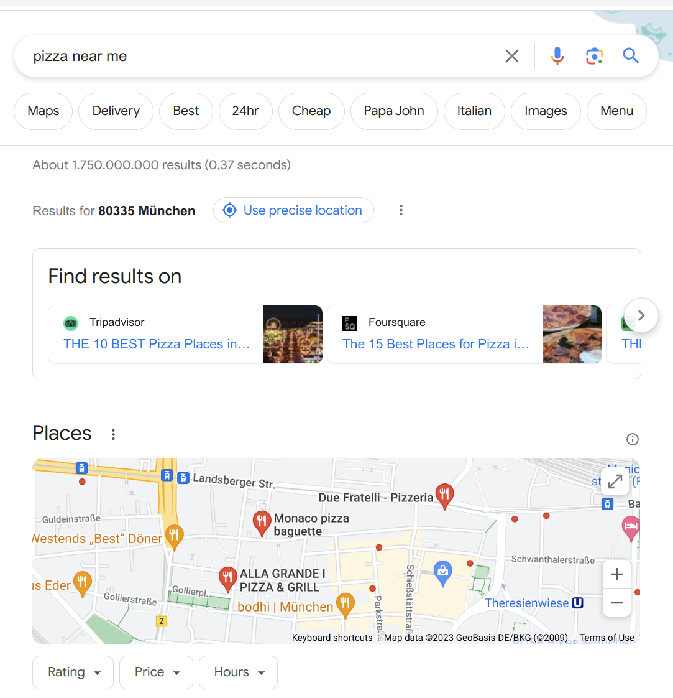
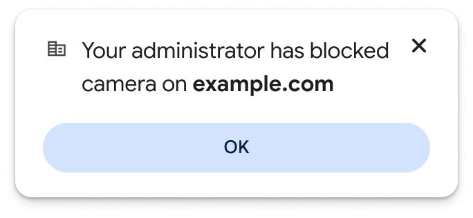

# Page Embedded Permission Control (PEPC)

## tl;dr

We propose a semantic permission element with styling constraints that ensures a
very high level of confidence concerning *user intent* to make a permission
decision. We believe this solves user problems related to accessibility,
context, regret, and more.

The permission element is designed to be more [accessible](#accessibility) and
more secure than the current permission flows. Full page modal confirmation UI
reduces the risk of change blindness and makes it more difficult for sites to
manipulate the user's decision making by obscuring site content during the
critical decision moment of the journey.

A semantic element and modal UI are connected in the same proposal as accurately
capturing user intent is essential to reducing the modal's potential for user
annoyance.

While we believe improvements to existing capability based permission flows can
and should be explored, we believe there to be limited headroom for
optimization, and that this proposal offers a significantly better user
experience for users and developers.

## Table of Contents
<!-- TOC start -->

- [Introduction](#introduction)
- [Proposal](#proposal)
- [Goals & non-goals](#goals-non-goals)
- [Adoption ](#adoption)
- [Developer trials](#developer-trials)
- [Design considerations](#design-considerations)
   * [HTML element](#html-element)
      + [Usage](#usage)
      + [Restrictions](#restrictions)
      + [PEPC attributes](#pepc-attributes)
   * [Permission UI](#permission-ui)
      + [Standard UI](#standard-ui)
      + [UI when the user can't change the permission](#ui-when-the-user-cant-change-the-permission)
      + [UI when there is a mechanism that would block the request](#ui-when-there-is-a-mechanism-that-would-block-the-request)
      + [UI when the permission is already granted](#ui-when-the-permission-is-already-granted)
   * [Complexity ](#complexity)
   * [Implementor portability, internationalization & upkeep](#implementor-portability-internationalization-upkeep)
   * [Fallback solutions](#fallback-solutions)
- [Security](#security)
   * [Threat model](#threat-model)
      + [Safety](#safety)
      + [Annoyance](#annoyance)
   * [Fallbacks when constraints are not met](#fallbacks-when-constraints-are-not-met)
   * [Locking the PEPC style](#locking-the-pepc-style)
   * [One PEPC per permission type per page](#one-pepc-per-permission-type-per-page)
   * [Conditions for usage in subframes](#conditions-for-usage-in-subframes)
   * [Custom cursors](#custom-cursors)
   * [Synthetic click events](#synthetic-click-events)
- [Privacy](#privacy)
   * [Exposing user information bits](#exposing-user-information-bits)
- [Status quo elaboration](#status-quo-elaboration)
   * [Permission prompts UX evaluation](#permission-prompts-ux-evaluation)
   * [User Agent abuse mitigations](#user-agent-abuse-mitigations)
- [Alternatives considered](#alternatives-considered)
   * [No platform changes](#no-platform-changes)
   * [Improve existing usage triggered permission request journey](#improve-existing-usage-triggered-permission-request-journey)
   * [Separate this into two proposals, (1) improved user intent signal and (2) modal permission prompts](#separate-this-into-two-proposals-1-improved-user-intent-signal-and-2-modal-permission-prompts)
   * [Extending an existing element](#extending-an-existing-element)
   * [Providing a registration JS API](#providing-a-registration-js-api)
   * [Extending the Permissions API to provide an anchor point](#extending-the-permissions-api-to-provide-an-anchor-point)
   * [Allowing recovery via the regular permission flow](#allowing-recovery-via-the-regular-permission-flow)
   * [Implementing an origin based permission allow list registry](#implementing-an-origin-based-permission-allow-list-registry)
- [Extending the PEPC in the future](#extending-the-pepc-in-the-future)
   * [PEPC for additional user agent settings](#pepc-for-additional-user-agent-settings)
   * [Not "just" a button](#not-just-a-button)

<!-- TOC end -->

<a name="introduction"></a>
<!-- TOC --><a name="introduction"></a>
## Introduction

When making decisions about whether or not to expose particularly powerful
capabilities to a given website, user agents generally
[pass the question on to users](#permission-prompts-ux-evaluation).
Historically, this began as a fairly direct passthrough: a site would ask for
some capability and the user agent immediately prompts asking users to make a
decision for the request.

Spam and abuse have forced user agents to take a more opinionated approach to
protect users' security, privacy, and attention. A number of preconditions and
mitigation measures have evolved, ranging from straightforward
[user activation requirements](https://developer.mozilla.org/en-US/docs/Web/Security/User_activation),
permanent "block" policies, or
[complex heuristics](https://blog.google/products/chrome/building-a-more-helpful-browser-with-machine-learning/).
However these measures have limited effect
[as indicated by metrics](#user-agent-abuse-mitigations).

Challenges with the status quo include:

1.  **Insufficiency of existing mitigations**: The present day permissions spam
    and abuse mitigation approach has an architectural upper bound on user
    protection because the model relies on the website to choose when to trigger
    the permission request prompt rather than capturing a reliable signal of
    user intent. Requiring a user gesture to
    [request permission to use a powerful feature](https://www.w3.org/TR/permissions/#dfn-request-permission-to-use)
    (or similar) does not solve this problem as there are many ways of tricking
    a user into providing a so called
    "[activation triggering input event](https://html.spec.whatwg.org/#activation-triggering-input-event)"
    (i.e., a user gesture, such as clicking the mouse or pressing a key) .

1.  **Context**: Ideally, a site's developer will request access as part of a
    contextual flow that helps users understand what's being asked for and why,
    enabling quick and confident responses. Often, however, permission requests
    are correlated poorly with user expectations, up to and including prompts
    that can come out of nowhere (see example 1). This places a burden on user
    agents' presentation of the request. The user agent has no semantic
    understanding of events taking place in the content area prior to the
    permission request. User agents could make better decisions and provide
    better prompts if they could make well-founded assumptions about the nature
    of the user's interaction in the content area, and the user's intent. At the
    moment user agents are limited to trying to make use of potentially ambigous
    signals such as the time elapsed between page load and the permission
    request.

     \
    *Example 1. A notification permission prompt on a news site (contents
    blurred), shown after the user has clicked on the empty area next to the
    article content. The user finds this prompt interruptive as they had no
    interest in subscribing to notifications, and they will likely struggle to
    understand why the prompt was shown to begin with.*

1.  **Location**: In the ideal case above, users will interact with something on
    a site that triggers a prompt. In less ideal cases, the user might not have
    interacted with anything at all, or they may have interacted with an element
    that was unrelated to the request. Given this uncertainty, user agents rely
    on common placement of the permission prompt, usually in the top-left of the
    page. Even in the best case, this has the unfortunate effect of shifting the
    point to which users need to pay attention from the thing they clicked on to
    some distant part of the user agent's UI (see example 2). User agents could
    make better decisions and provide better prompts if they could make
    well-founded assumptions about the nature of the user's interaction in the
    content area, and the user's current area of focus. In effect, we think
    there is a benefit to semantic markup for permissions.

     \
    *Example 2. An example where the permission prompt is far away from the
    user's current area of focus. The permission prompt was triggered because
    the user has just clicked on the crosshair icon in the bottom right, but the
    prompt is easy to miss since it's on the opposite side of the page.*

1.  **Regret**: Given the challenges of permission annoyance and abuse, it is
    reasonable for user agents to suppress a site's future requests for the same
    capability when the first request is blocked. That said, our research shows
    that users can and do change their minds for good reasons. When they change
    their mind, the site can no longer offer an interface in web content and the
    user must search for the appropriate user agent surface. Our research shows
    that users often fail when trying to do so (see example 3). In these cases,
    the user agent's desire to protect the user backfires, and makes the user's
    experience worse as the site will not work as the user wants. User agents
    can help users recover from a permission regret state if they can make
    well-founded assumptions about the nature of the user's intent and
    interaction with web content.

     \
    *Example 3. An example where the user previously blocked camera and
    microphone access, but has now just expressed a strong intention to
    re-enable them by clicking the unmute buttons. Because the user agent has no
    insight into this interaction in the content area, it is compelled to
    respect the user's previous decision. Especially in a stressful scenario
    such as an important presentation, users will struggle to navigate the
    settings surfaces to change the permission decision.*

1.  <a name="accessibility"></a>**Accessibility**: Permission UI for a
    capability is triggered through the direct use of the capability. Typically
    JavaScript invokes permission UI, presenting an issue for both screen
    readers and magnification users.

    Script attached to an existing DOM element is not interpreted by the screen
    reader. If the DOM element was not accessibility tested and does not provide
    sufficient explanation to its function, there is no way for a screen reader
    user to know that the purpose of that element is to initiate access to a
    capability. Current permissions can be accessible if properly implemented
    and tested, PEPC is *accessible by default*.

    Magnification users also struggle with the status quo. A page cannot detect
    if a user is using OS level magnification tools (WAI for privacy reasons). A
    user in a magnified state can easily miss the permission prompt if it falls
    outside of their magnified viewport, and pages cannot assist these users.
    With PEPC, the scrim and a contextually localized prompt greatly increase
    the chance that the magnification user will observe the permission request
    after interacting with the element.

Optimizing the trade-off between usability and interruptions hit practical
limits because, fundamentally, user agents
[still lack any understanding of the](#permission-prompts-ux-evaluation)
semantics of user interactions in the content area (i.e. the web page), and
consequently lack insight into the user's present context and task they are
trying to accomplish.

To improve upon the status quo, user agents need to be able to extract
trustworthy signals from the content about the user's task and intent, so they
can be more opinionated and confident in their communication to users regarding
capability access. This is especially important if user agents want to safely
enable users to change their minds while still *respecting user's earlier
permanent block decisions*.

<!-- TOC --><a name="proposal"></a>
## Proposal

*Summary: We propose a new HTML element to the web platform which will be used
to provide an in-content entry point to permission requests. This HTML element
will look like a button and be used just like any other HTML element. The key
difference is that clicking this button will trigger a permission request for
which the user agent can have good confidence that it was user-initiated. The
element will have appropriate safeguards to protect users from common spam and
abuse patterns such as click jacking.* *We propose the name "Page Embedded
Permission Control" which can be abbreviated as PEPC.*

To extract a strong signal of user intent, we believe that user agents require
verification of the user interaction step that happened in the content area
directly before the developer triggers the showing of the permission prompt.

We propose to achieve this through introducing a `<permission>` element: a
semantic and semi-trusted UI element that the developer can embed into the
content area. At its simplest, the element takes the shape of a button whose
[appearance](#locking-the-pepc-style) and [behavior](#restrictions) are
materially [controlled](#security) by the user agent, to the extent that is
necessary to ensure interaction with this element is a strong indication of user
intent to use a certain capability.

Developers who follow best practices often implement similar permission flows
today, either as part of their onboarding experience, or as a permanently
displayed affordance on their UI. These developers invite the user to click on a
button to indicate interest, and see grant rates as high as 95% in the
permission prompts that follow. For these developers, the permission element
will be a drop-in replacement that is straightforward to adopt and easy to
polyfill on browsers which do not support the PEPC. Here are some real-life
examples:

 \
*Example 4: A video-conferencing site. Clicking on the "Enable camera" button
triggers a camera permission request.*

 \
*Example 5: A search site. Clicking on "Use precise location" triggers a
geolocation permission request.*

 \
*Example 6: A messaging site, clicking on the "Enable Desktop Notifications"
button triggers a push notifications permission request.*

We believe that enshrining such a user-initiated approach in standards can
contribute to consistently better permission request flows across the web. This
is because the permission element offers the following compelling advantages to
users and developers alike:

-   It is **non-interruptive**: it is static, small, and contained in the
    content area on the same z-level.
-   It is **discoverable**: it can be placed by the developer within the user's
    focus of attention; with the locality making it easier to find and more
    convenient to interact with.
-   It provides more **contextual information**: it has a visual manifestation
    as opposed to being a procedural API, requiring developers to think about
    integrating it into the user journey at UX design time, as opposed to being
    left as an afterthought during implementation, resulting in knock-on effects
    relating to clearer context.
-   It allows users to **revert** a previous "deny" decision if they have
    changed their mind and are now interested in the feature that the site
    provides.
-   It is more **accessible**. The PEPC can have standard, localized, screen
    reader announcements that make the purpose of the element comprehensible and
    consistent across websites. The scrim and a contextually localized prompt
    greatly increase the chance that a magnification user will observe the
    permission request after interacting with the element.

Example usage:

```html
<style>
  permission {
    background-color: blue;
    color: white;
    border-radius: 10px;
  }
</style>

<permission
  onpromptdismiss="showContextInfo()"
  type="microphone"
/>

<script>
  function showContextInfo() {
    // Provide some additional information since the     .
    // user has just dismissed the permission prompt     .
    // without making a decision.
  }
  navigator.permissions
    .query({ name: 'microphone' })
    .then((permissionStatus) => {
      permissionStatus.onchange = () => {
        if (permissionStatus.state === 'granted') startUsingMic();
      };
      if (permissionStatus.state === 'granted') startUsingMic();
    });
</script>
```


A sample user agent implementation given as an example. The permission element
is a button whose text is controlled by the user agent. It can be styled by the
developer to a degree, including limited control over colors and border styling.
Clicking the permission element shows a permission prompt (owner by the user
agent).


<!-- TOC --><a name="goals-non-goals"></a>
## Goals & non-goals

The goal of this proposal is to provide a definition of a Page Embedded
Permission Control (PEPC) as a means to improve the permission request flow and
to provide a list of security considerations and design options that user agents
should consider.

The PEPC should both integrate seamlessly with the site but also not be easily
abusable by the site. The PEPC should provide a strong signal of the user's
intent to start using some permission-gated feature and therefore allow user
agents to make more informed decisions about how to present permission requests
to the user.

In the long-run the PEPC should become the default solution that sites use to
interact with permission-gated capabilities since it provides a higher quality
experience for the user and simplified developer ergonomics; the existing
JS-only APIs can still be used when an in-page element solution does not fit the
particular use case.

<!-- TOC --><a name="adoption"></a>
## Adoption 

PEPC does not to replace existing permission journeys to benefit a large 
fraction of the users who interact with permission gated capabilities. A relatively small number of sites account for a large
fraction of permission requests with real world benefit, for example : 

* Workplace collaboration & social sites requiring Camera/microphone access, such as popular video conferencing and chat apps with voice and/or video functions
* eCommerce sites with store locators

We hope to establish through [developer trials](#developer-trials) whether PEPC sufficiently addresses user problems and meets developer needs to gain the traction needed to justify support for this feature. 

<!-- TOC --><a name="developer-trials"></a>
## Developer trials

We have done laboratory user experience testing of the user problems & solution
described in this document. However, we would like to validate whether we have
properly described the user problems and the appropriateness of the solution
with a developer trial of a minimally implemented version of the feature for a
subset of most frequently used permission types.

<!-- TOC --><a name="design-considerations"></a>
## Design considerations

<!-- TOC --><a name="html-element"></a>
### HTML element

<!-- TOC --><a name="usage"></a>
#### Usage

The PEPC should be easy to integrate into the site and therefore it should be
styleable via CSS like any regular button. For example:

```html
<style>
  permission {
    background-color: lightgray;
    color: black;
    border-radius: 10px;
  }
</style>
<permission type="geolocation" />
```


Since the PEPC content is controlled by the user agent, and it should have no
child elements, the parsing model will not include content or the end tag
(similarly to the
[input element](https://html.spec.whatwg.org/multipage/input.html#the-input-element)
parsing model).

When the relevant permission is granted (either previously if the user agent's
permission model allows for it, or during the current session), the text should
change to something informational in order to convey this (e.g. "Location
shared" for a geolocation PEPC). The user agent should also provide a different
type of UI that allows the user to change their decision. Also, a site might
wish to style the PEPC differently in the granted state so a CSS pseudo-class
":granted" will be supported.

Example usage:

```html
<style>
  permission {
    background-color: lightgray;
    color: black;
    border-radius: 10px;
  }
  permission:granted {
    background-color: white;
    color: blue;
  }
</style>
<permission type="geolocation" />
```

 \
"not granted" state

 \
"granted" state

It is not particularly useful to distinguish between different types of "not
granted" states (e.g. a state of `prompt` vs `denied`) as the goal is to provide
the user with a way forward to grant the required permission to the site,
regardless of what permission state they currently find themselves in. Therefore
only a `:granted` CSS pseudo-class is proposed.

Sites may wish to modify the appearance (or hide) the PEPC when it fails
validation. Therefore a `:invalid` CSS pseudo-class is also proposed. The
invalid pseudo-class is applied when the element's validation status changes
because of 'style' 'type_count' or 'illegal_subframe' reasons. The style should
not be set when the element is not valid for transient reasons.

The PEPC should be used in parallel with the Permissions API which already
provides the necessary support to allow a site to respond to permission status
changes. This is the encouraged pattern because it ensures that the site will
also respond to permission status changes that are not caused by direct
interaction with the PEPC (for example, user agents generally allow users to
control permissions on various UI surfaces that are entirely separate from the
site's rendering area). Therefore events specific to the PEPC will only deal
with the user's actions on the Permission UI, and specifically with the user
closing it either by dismissing it or by taking some other action on it that
causes it to close (e.g. they accept it). This allows sites to respond to this
event by providing more context to potentially help the user make a decision.
These two events will be added to
[GlobalEventHandlers](https://html.spec.whatwg.org/#globaleventhandlers) and can
only target `permission` HTML elements. They do not bubble and are not
cancelable.

-   `onpromptdismiss` - raised when the permission UI triggered by the PEPC has
    been dismissed by the user (for example via clicking the 'x' button or
    clicking outside the prompt).
-   `onpromptaction` - raised when the permission UI triggered by the PEPC has
    been resolved by the user taking some action on the prompt itself. Note that
    this does not necessarily mean the permission state has changed, the user
    might have taken an action that maintains the status quo (such as an action
    that continues allowing a permission on a
    [previously granted](#ui-when-the-permission-is-already-granted) type of
    UI).
-   `onvalidationstatuschange` - raised when the PEPC switches from being
    "valid" to "invalid". The PEPC is considered "valid" when the user agent
    trusts the integrity of the signal if the user were to click on it, and
    "invalid" otherwise. There are many reasons for which an element can become
    "invalid" as detailed in the [Security](#security) section, but to enumerate
    a few: element style is invalid, element is covered, element has recently
    moved, element has changed size, element is not fully visible in the
    viewport, etc. The following two attributes are added to the `permission`
    object which are related to the validation status:
    -   `boolean is-valid` - indicates whether the status has transitioned to
        "valid" or not.
    -   `string reason` - indicating the reason why the status is "invalid" (or
        "" if it's valid), and can be one of the following values:
        ["style"](#locking-the-pepc-style),
        ["type_count"](#one-pepc-per-permission-type-per-page),
        ["illegal_subframe"](#conditions-for-usage-in-subframes),
        ["covered"](#threat-model), ["recently_moved"](#threat-model),
        ["recently_created"](#threat-model).

Example usage:

```html
<permission type="geolocation" onpromptdismiss="showLocationWarning()" />
<script>
  // Called when the PEPC-triggered permission flow has been canceled by the user
  // without a decision being made.

  function showLocationWarning() {
    // Here the site could, for example, provide additional context next to the
    // PEPC such as "feature X will not work without location".
    …
  }

  // Use the permissions API to check when "feature X" can start being used.

  navigator.permissions.query({name: "geolocation"})
    .then((permissionStatus) => {
      permissionStatus.onchange = () => {
        // Track future status changes that allow the site to start using feature X.
        if (permissionStatus.state == "granted")
          startFeatureX();
      };
      // The permission status could already be granted so the site can use feature X already.
      if (permissionStatus.state == "granted")
          startFeatureX();
    });
</script>
```

<!-- TOC --><a name="restrictions"></a>
#### Restrictions

It is crucial that the site is not able to easily abuse the PEPC to trigger a
permission prompt without the user's express intent, because the user agent
should be able to have reasonable confidence that the user intended to trigger a
permission flow.

In order to maintain the integrity of the user intent, the user agent needs to
mitigate situations that would allow malevolent sites to obtain a click on the
PEPC by using deceitful tactics. The [Security](#security) section elaborates on
this aspect.

<!-- TOC --><a name="pepc-attributes"></a>
#### PEPC attributes

<table>
  <tr>
    <td>type</td>
    <td>
      Used to specify which permission the PEPC applies to. Can also be a
      space-separate list of permissions if the user agent support grouping
      these permission together (e.g. microphone and camera permission requests
      are commonly grouped together)
    </td>
  </tr>
  <tr>
    <td>type-ext</td>
    <td>
      Allows specifying additional parameters for certain permission types, in
      the form of space-separate key: value pairs.
      The supported key/values are:
      <ul>
        <li><code>sysex: true/false</code> (for the
         <a href="https://webaudio.github.io/web-midi-api/#permissions-integration">
        midi</a> permission type)
        </li>
        <li><code>precise:true/false</code> (for the
        <a href="https://www.w3.org/TR/geolocation/#position_options_interface">
        geolocation</a> permission type)
        </li>
        <li><code>panTiltZoom:true/false</code> (for the
        <a href="https://github.com/w3c/mediacapture-image/blob/main/ptz-explainer.md#control-camera-pantilt">
        camera</a> permission type)
        </li>
      </ul>
    </td>
  </tr>
  <tr>
    <td>onpromptdismiss onpromptaction onvalidationstatuschange</td>
    <td>Event handlers as discussed above.</td>
  </tr>
  <tr>
    <td>is-valid reason</td>
    <td>As discussed above.</td>
  </tr>
  <tr>
    <td>lang</td>
    <td>
      The global
      <a href="https://html.spec.whatwg.org/multipage/dom.html#attr-lang">lang</a>
      attribute has further purpose on the `permission` HTML element. Since the
      contents of the PEPC is set by the user agent, this attribute will indicate
      what language the text should be in. The user agent will attempt to provide
      the text in that language if possible.<br/><br/>
      Note: This will only be used to determine the language of the HTML element,
      not of the permission confirmation UI itself. The permission UI should use
      the same language that the rest of the user agent uses on similar security
      surfaces.
    </td>
  </tr>
</table>

<!-- TOC --><a name="permission-ui"></a>
### Permission UI

After the user clicks on the PEPC, a confirmation UI should be presented to the
user by the user agent in order to confirm their decision to grant the
permission and to potentially allow the user to configure their decision. It is
up to the user agent to design this confirmation UI, however there are some
considerations that should be taken into account:

-   The user agent should consider different UI for different scenarios based on
    the current permission status
-   The user agent should consider making use of the PEPC relative page position
-   The user agent should consider how the PEPC interacts with any mechanisms
    they have in place that would normally prevent permission request from
    reaching the user

<!-- TOC --><a name="standard-ui"></a>
#### Standard UI

Since the user agent has the strong signal of the user's intent and current
focus, it can use this to improve the general UX without risking interrupting
the user.

Here is an example of what the user might be presented with after they click the
PEPC:


And a close-up of just the confirmation UI:


Key points to consider:

-   The confirmation UI can make use of the PEPC position to position itself on
    the screen
-   The confirmation UI can be brought more into attention by the user agent. In
    the example above this is done by the user agent applying a gray filter over
    the site content area
-   The confirmation UI should have an obvious way for the user to change their
    mind

<!-- TOC --><a name="ui-when-the-user-cant-change-the-permission"></a>
#### UI when the user can't change the permission

There are many user agents that offer mechanisms for permission granting that
involve some sort of administrator or management system, which the user can not
override. In this type of situation, the PEPC text itself should not change (as
it can be used as a potential fingerprinting bit), instead the confirmation UI
should clarify the situation to the user. For example:



<!-- TOC --><a name="ui-when-there-is-a-mechanism-that-would-block-the-request"></a>
#### UI when there is a mechanism that would block the request

As discussed previously there are many mechanisms that user agents implement
that prevent permission requests: permanent denies (either implicit or
explicit), duration-based denies, heuristics, blocklists, ML-based automatic
blocks etc.

Each of these mechanisms should be carefully weighed against the strong signal
sent by the user by clicking the PEPC. It might be the case that this signal
should override some of these mechanisms entirely (e.g. heuristics or ML models
are probably good candidates to not apply to PEPC-triggered permission prompts)
or that some compromise needs to be reached. It is impossible to go into more
detail here since all user agents have their own mechanisms and end-goal for
what a good permission UX is.

As an example, this is how a confirmation UI could look when the site is in a
"deny" state but the user has clicked the PEPC:


<!-- TOC --><a name="ui-when-the-permission-is-already-granted"></a>
#### UI when the permission is already granted

When the permission is granted the PEPC text changes to reflect this. This also
serves as a confirmation of the user decision having taken effect (though the
user agent should not rely on the PEPC as an always-visible indicator).

When the user clicks on the PEPC in this state, a permission prompt does not
make much sense. Instead the UI could be used for other reasonable purposes, for
example to allow the user to change their previous decision.

An example of how this could look:


<!-- TOC --><a name="complexity"></a>
### Complexity 
Most of the implementation complexity of the PEPC lies in the annoyance reduction mechanisms. As previously mentioned, the main security surface is the "Confirmation UI" which is straightforward to implement. 

This proposal describes a deliberately conservative set of annoyance reduction mechanisms with the aim to discovering in [developer trials](#developer-trials) which restrictions will be infeasible for users, developers or implementors. 

<!-- TOC --><a name="implementor-portability-internationalization-upkeep"></a>
### Implementor portability, internationalization & upkeep
Most browsers already have user recognizable iconography for common permissions such Camera/Microphone or Location and the PEPC can share strings used in the existing permission journey. 

Developers will need to handle the `onvalidationstatuschange` event, which helps to future proof websites against unexpected changes in browser implementor validation criteria. 

<!-- TOC --><a name="fallback-solutions"></a>
### Fallback solutions

Unsupported browsers will need to implement fallback solutions which will slow
adoption. However, we believe this is surmountable for two reasons:

1.  In many cases the polyfill will not be needed as the PEPC can augment
    existing journeys.
1.  In cases where the PEPC replaces existing journeys the polyfill is typically
    straightforward, with a button linking to capability usage.
1.  In UX testing we have found the PEPC significantly outperformed other
    permission request flows for both user & developer preferred outcomes (lower
    decision "regret", whether granted or blocked), and a much higher success
    rate of users reverting past decisions they regretted. This makes the PEPC
    appealing to developers in use cases where a permission is critical to a
    specific user journey, such as a user interacting with a locator when trying
    to find their hotel.

We would like to validate whether our assumptions concerning fallback solutions
with real developer trials of a prototype implementation.

<!-- TOC --><a name="security"></a>
## Security

<!-- TOC --><a name="threat-model"></a>
### Threat model

The goal of user agents should be to ensure that the PEPC is not trivial to
abuse. There are two primary types of abuse: safety, and user annoyance which we
will consider separately as they are addressed by the confirmation UI and by
constraints on the PEPC element respectively.

<!-- TOC --><a name="safety"></a>
#### Safety

The safety of PEPC hinges on there being a permission prompt that is used to
confirm the user's decision to grant the permission, we call this the
"Confirmation UI". The confirmation UI is strictly better than the existing
non-modal permission prompt implemented by most browsers because it:

-   (Same as current UI) is generated by the browser, with the only inputs
    accepted from the website are permission(s) types requested.
-   Modal, requiring explicit dismiss or decision gesture for the user journey
    to continue, with website content obscured with a semi-opaque and blurred
    scrim which prevents the site from manipulating the user's decision making
    or obfuscating the modal content.

The strict constraints of the confirmation UI make the PEPC minimally as safe
(and arguably safere) than existing non-modal UI.

<!-- TOC --><a name="annoyance"></a>
#### Annoyance

Mitigating annoyance by ensuring user intent is more complex than ensuring the
safety of the PEPC, but equally important to the goals of the proposal. Without
mitigating annoyance we don't believe it to be reasonable to impose the safer,
but more disruptive, modal confirmation UI.

The site can use techniques to annoy the user by repeatedly triggering modals,
including:

-   The site could trick the user by choosing some misleading text (e.g. "Click
    here to proceed"). Therefore the text on the PEPC should not be able to be
    set by the site, instead the user agent should make sure to set it to
    something comprehensive (e.g. "Share location" for a geolocation PEPC).
-   The style of the PEPC can be set to obscure the purpose (e.g. setting the
    same text color and button color would make the text unreadable). Therefore
    the style should be verified, validated and overridden by the user agent as
    needed. More details in the
    [Locking the PEPC style](#locking-the-pepc-style) section
-   The PEPC might be partially covered (to hide the text) with another HTML
    element. Therefore the user agent should verify that the PEPC has been
    visible already for some short time (e.g. 500ms or so) before it's clicked.
    User agents that implement the
    [IntersectionObserverV2](https://github.com/w3c/IntersectionObserver/blob/v2/explainer.md)
    API can make use of it internally.
-   The site might try to obtain a click on the PEPC by moving it where the user
    is about to click. Therefore the user agent should ensure that the PEPC has
    not been moved recently (e.g. in the past 500ms or so).
-   The site might try to obtain a click on the PEPC by inserting it into the
    DOM where the user is about to click. Therefore the user agent should ensure
    that the PEPC has not been inserted into the DOM recently (e.g. in the past
    500ms or so).

Reminder: the user agent-rendered confirmation UI after the user clicks on the
PEPC is what makes the PEPC ultimately secure. User agents should take proper
care to ensure this confirmation UI is at least as secure as their current
permission prompt flow.

<!-- TOC --><a name="fallbacks-when-constraints-are-not-met"></a>
### Fallbacks when constraints are not met

The [Security](#security) section has details on various mitigations and checks
that the user agent should strongly consider implementing to preserve the
integrity of the strong signal of user intent that the PEPC should provide. User
agents should also consider how to handle scenarios where these checks or
mitigations fail, and most importantly what the outcome of a click on the PEPC
should then be.

There are 3 main possible approaches to consider, if the integrity of the PEPC
click is not assured:

-   The click triggers the legacy permission flow (as if it was triggered by the
    equivalent JS API). This approach is worth considering if the failing check
    or mitigation is not something self-correcting (e.g. styling issue or the
    PEPC being covered).
-   The click does nothing. This approach is worth considering if the failing
    check or mitigation will self-correct itself (e.g. if the PEPC has moved
    recently there will be a short cooldown before the PEPC integrity is
    restored).

<!-- TOC --><a name="locking-the-pepc-style"></a>
### Locking the PEPC style

User agents should lock down the styling of the PEPC in regards to the color,
size, border, rounding, contents, icon, etc. of the PEPC, as outlined below.
This provides protection against some of the clickjacking and social engineering
attacks that bad actors might use to trick the user into clicking the element.

We are working with developers to ensure the correct tradeoff between sufficient
developer control over the look-and-feel of the PEPC, while ensuring that the
browser has captured user intent. The proposal in this explainer intentionally
errs on the side of being cautiously over-restrictive, as this will minimize the
threat surface area and acts as a forcing function for developer feedback on
proposed styling restrictions during trials.

<table>
  <tr>
    <td>Property</td>
    <td>Rule</td>
  </tr>
  <tr>
    <td>
      color<br />
      background-color
    </td>
    <td>
      Set by default to the user agent's default `button` colors. The user agent
      should consider accessibility guidelines for sufficient contrast, for
      example the
      <a href="https://www.w3.org/TR/WCAG21/#contrast-minimum">WCAG AA 4.5:1</a>
      formula to ensure text is legible.
    </td>
  </tr>
  <tr>
    <td>box-shadow</td>
    <td>
      Not allowed if it contains ‘inset' as it can be used to cover the
      background and therefore affect contrast.
    </td>
  </tr>
  <tr>
    <td>font</td>
    <td>
      Care should be taken to ensure the font used is easily legible (e.g. not
      any <a href="https://en.wikipedia.org/wiki/Dingbat">dingbat font</a>). The
      user agent should either hard set the font value without allowing
      override, or should maintain a curated list of allowed fonts.
    </td>
  </tr>
  <tr>
    <td>font-size</td>
    <td>Needs to be large enough to ensure the font is legible.</td>
  </tr>
  <tr>
    <td>
      width<br />
      min-width<br />
      max-width
    </td>
    <td>
      The user agent should ensure the PEPC width is sufficient to not let
      contents overflow. This requires computing the text size (based on font)
      programmatically and potentially adding the icon width if present.
    </td>
  </tr>
  <tr>
    <td>
      height<br />
      min-height<br />
      max-height
    </td>
    <td>
      The user agent should ensure the PEPC height is sufficient to not let
      contents overflow. Intuitively this means the height should never be
      allowed to be smaller than 1em.
    </td>
  </tr>
  <tr>
    <td>opacity</td>
    <td>
      Should never be anything other than 1, for the PEPC and all its ancestors.
    </td>
  </tr>
  <tr>
    <td>line-height</td>
    <td>
      Can potentially be used to alter the position of the text in the PEPC. The
      user agent should consider hard setting this to ‘normal' without allowing
      sites to override it.
    </td>
  </tr>
  <tr>
    <td>cursor</td>
    <td>
      Any values other than the predefined cursors won't have effect (no custom
      cursors).
    </td>
  </tr>
  <tr>
    <td>whitespace</td>
    <td>User agents should consider hard setting this to ‘nowrap'.</td>
  </tr>
  <tr>
    <td>user-select</td>
    <td>User agents should consider hard setting this to ‘none'.</td>
  </tr>
</table>

In these cases the user agent should either override the style to maintain the
PEPC integrity or allow the style, but trigger the legacy prompt flow instead.

For practical purposes it is recommended that user agents keep a curated list of
style properties which are allowed, and any other style property is discarded by
default.

<!-- TOC --><a name="one-pepc-per-permission-type-per-page"></a>
### One PEPC per permission type per page

To prevent sites from tile-covering their site with PEPCs, there should be a
limit of at most one PEPC per permission type, per page.

<!-- TOC --><a name="conditions-for-usage-in-subframes"></a>
### Conditions for usage in subframes

Subframe usage will be allowed but several security constraints need to be
enforced:

-   Permission Policy should be first checked to ensure that the permission is
    allowed in the subframe.
-   A valid `X-Frame-Options` header or a `frame-ancestors` CSP policy needs to
    be set to prevent clickjacking attacks where a malicious site embeds a
    legitimate site that uses a PEPC.

<!-- TOC --><a name="custom-cursors"></a>
### Custom cursors

Custom cursors should be disabled when the cursor is hovering over the PEPC
because they can have a potentially misleading hitpoint.

<!-- TOC --><a name="synthetic-click-events"></a>
### Synthetic click events

Click events which are simulated by the site (e.g. via the `click()` function)
should not be considered.

Click-like event handlers (such as `onclick`, `onmousedown`, etc.) will function
as expected.

<!-- TOC --><a name="privacy"></a>
## Privacy

<!-- TOC --><a name="exposing-user-information-bits"></a>
### Exposing user information bits

Extreme care needs to be taken to ensure that information is limited to what a
site needs to know. Information that can be already determined (for example via
the Permissions API) is fine to be exposed via the PEPC. Other sensitive
information should not be.

*Example:* Many user agents provide a way for an admin to manage certain
permissions on behalf of the user. In such cases the user agent might decide to
have the PEPC text reflect this state, perhaps by setting the PEPC text to
"Admin blocked". This would however provide information to the site that they
would otherwise not be privy to, namely that the user's settings are partially
controlled by an administrator.

<!-- TOC --><a name="status-quo-elaboration"></a>
## Status quo elaboration

<!-- TOC --><a name="permission-prompts-ux-evaluation"></a>
### Permission prompts UX evaluation

Below are two examples of browser permission prompts. The prompts are triggered
when the site starts using some specific sensitive capability. Transparently to
the site, the user agent will decide whether user consent is needed (based on a
variety of factors such as previous decision, settings, etc.) and it will
trigger the permission prompt if it is indeed needed. The permission prompts are
drawn starting from a fixed point above the web content area.

 \
*Example notification permission prompt on Chrome*

 \
*Example location permission prompt on Firefox*

In order to evaluate the user experience for these prompts **from the
perspective of the user agent**, there are some questions that can be
considered:

1.  Does the user notice this prompt or is their attention engaged elsewhere? \
    The prompt was triggered by the site using a JavaScript API at some point
    that might seem entirely arbitrary (from the user's perspective). There is
    no way to tell whether this has any connection to what the user is currently
    doing, which significantly increases the chance that the prompt will simply
    go unnoticed by the user.
1.  Does the user understand what the site feature that triggered this
    permission request does? Can they weigh the potential benefit that the
    feature can provide them against the potential downsides? The user might
    understand and be aware of why a site might request their permission to
    access some powerful feature, or they might have no context for this and
    there are no signals to distinguish between these scenarios.
1.  Does the user have any interest in the site feature that requires their
    permission? It could certainly be the case that this prompt is in response
    to the user showing interest in some feature (e.g. by pressing a button that
    says "Use my location" on a food delivery service site), but it could also
    be the case that the user is not interested in the feature at all.
1.  If the user chooses to deny the permission request here, will they know how
    to revisit this decision in the future should they change their mind? Many
    user agents implement some form of temporary or permanent deny decision
    policy to prevent sites from spamming permission prompt requests. However
    this makes it difficult for sites to recover from this state even if the
    user shows clear interest in the feature.

<!-- TOC --><a name="user-agent-abuse-mitigations"></a>
### User Agent abuse mitigations

The shortcomings of the current status quo of permission prompts practically has
the side-effect that user agents need to be quite defensive to shield users from
unwanted permission prompts:

1.  Many user agents implement a "permanent deny" policy, and other user agents
    offer it as an option in the permission prompt. This means that a site will
    not be able to ask for permission again after the user has blocked it.
    Sometimes this is for some fixed (or increasing) duration, not strictly
    speaking permanent. This helps prevent unwanted permission prompt spam
    though it can sometimes lead to user confusion if they wish to change their
    mind later as it requires them to discover the appropriate UI that allows
    them to make the change manually.
1.  Some user agents use heuristics, blocklists or ML-powered algorithms in an
    effort to shield users from unwanted permission prompts.

Even with these measures in place, most user interactions on permission prompts
are negative. For notifications (the most requested permission type), Google
Chrome metrics data shows that the percentage of prompts that are ignored,
dismissed or blocked by the user add up to approx 92% on desktop platforms and
85% on mobile devices.

A permission model designed to be initiated by the user would solve these
issues. If the user initiates the permission request it ensures that:

1.  The user understands the purpose of the permission, or at least has enough
    **context** to feel comfortable engaging in an activity that uses this
    permission.
1.  The user's current flow or task is related to granting this permission and
    as such it's unlikely that the permission request could be **interruptive**.
1.  The user agent can ensure the subsequent UI is placed near the current
    **focus** of attention of the user. This is because the user has just
    interacted with some piece of UI to request the permission which means their
    focus is likely in the area. Because of the above, it is unlikely that such
    a placement is interruptive or annoying.

<!-- TOC --><a name="alternatives-considered"></a>
## Alternatives considered

<!-- TOC --><a name="no-platform-changes"></a>
### No platform changes

Sites could replicate most of this behavior currently by using a button that
triggers the permission request. Developers could be actively encouraged to use
this pattern via articles, communications etc.

Disadvantages:

1.  There is no signal or guarantee indicating the user's intent. This means
    that the user agent still needs to remain defensive about permission
    requests.
1.  It requires user experience design and consideration from the site's side.
    There are many ways to get this wrong and provide a suboptimal user
    experience. Also, providing a solution with best-practices built in helps
    resource-constrained development teams more.

<!-- TOC --><a name="improve-existing-usage-triggered-permission-request-journey"></a>
### Improve existing usage triggered permission request journey

The existing permission request journey is triggered by usage of the relevant
capability, for example, `getUserMedia` triggering a Camera permission journey.
We agree there may be ways to improve the current journey and we intend to
explore these in parallel, however, there is an upper bound to improvements.
Specifically:

1.  Accessibility. Native HTML elements (such as the proposed permission element
    in this explainer) come with built-in roles, properties, and keyboard
    interaction behaviors understood by assistive technologies. While JavaScript
    solutions can be *made* accessible, the PEPC can be accessible by default.
1.  User intent. JavaScript triggered UI journeys will never be able to capture
    user intent the way we believe is possible with PEPC. User gestures are
    easily gamed by manipulative or malicious websites. It's difficult to see
    how more advanced heuristics could be used to determine user intent, and we
    believe that any heuristics to determine user intent would be significantly
    more complicated that determining user intent for the semantic element.
1.  Context. While sites *may* do a good job with providing context to the user
    about why a permission journey is happening, the PEPC *ensures* the context
    is present with consistent button UI and labels, and strong signal of user
    intent.
1.  Reconsideration. Sometimes users make a mistake in a permission decision.
    It's undesirable for browsers to allow users to reconsider past decisions
    with the usage-driven UI model, as enabling reconsideration would present
    spammy or abusive websites the ability to repeatedly prompt users who block
    a permission request. Help text directing users to navigate browser UI to
    revisit past permission decisions requires web developers to provide users
    with evergreen browser-specific directions on changes to the browser
    permission settings. In practice this is a significant burden on web
    developers, often results in stale directions, and users seldom succeed at
    these journeys even when the directions are up-to-date and clear.

<!-- TOC --><a name="separate-this-into-two-proposals-1-improved-user-intent-signal-and-2-modal-permission-prompts"></a>
### Separate this into two proposals, (1) improved user intent signal and (2) modal permission prompts

We believe these aspects of the proposal offer the most user utility when
bundled. If we only improve the user intent signal with a permission element, we
fail to solve for change blindness and accessibility problems for magnification
users. If we only introduce modal permission prompts without improving our
confidence in user intent and context we increase the level of interruption and
disruption in user journeys with blocking modals about which the user may have
little or no context for decision making.

<!-- TOC --><a name="extending-an-existing-element"></a>
### Extending an existing element

Instead of adding a new element, existing HTML elements can be augmented to
provide the same result. The immediate candidates are the `input` and `button`
elements which could have new properties added to achieve the same
functionality.

This could be an example of how this would look like:

```html
<p>
  Button:
  <button permission-type="geolocation"></button>
</p>

<p>
  Input:
  <input type="permission-control" permission-type="geolocation" />
</p>

<style>
  button[permission-type],
  input[permission-type] {
    background-color: white;
    color: blue;
  }
</style>
```


Disadvantages:

1.  `button`
    1.  Backwards-compatibility and interoperability: old versions and user
        agents that don't implement the permission element will still render and
        create a `button` element that does not do anything. This is a worse
        experience if not compensated with some other solution (e.g. a
        polyfill).
    1.  Flexibility: this proposal generally imagines the HTML control as a
        button, but future extensions of this element could instead use some
        different type of UI like a checkbox, a link, a radio etc.
    1.  Counter-intuitive: buttons usually have a lot more flexibility than the
        PEPC has (e.g. the button text is set by the author). A site author
        using the PEPC would have to be always aware of the differences between
        the PEPC and a regular button. If the behavior between elements is
        significantly different then it makes sense that they should be distinct
        elements.
1.  `input`
    1.  The `input` [element represents a typed data field, usually with a form
        control to allow the user to edit the
        data](https://html.spec.whatwg.org/multipage/input.html#the-input-element).
        Different input types are designed generally to be used as part of a
        form that the user enters data into and submits. While some exceptions
        exist (e.g. `<input type="button">`), they still represent controls that
        are supposed to integrate within a form (a `submit` or `reset` button, a
        hidden field etc.). Since there is no connection between forms and PEPC,
        adding a new input
        [type](https://html.spec.whatwg.org/multipage/input.html#attr-input-type)
        would be a poor design fit.

<!-- TOC --><a name="providing-a-registration-js-api"></a>
### Providing a registration JS API

A JS API could be used to mark a particular HTML element as the PEPC of the
page.

```html
<button id="pepc">Share location</button>

<script>
  pepc_params = {};
  pepc_params['type'] = 'geolocation';
  navigator.permissions.registerPEPC(
    document.getElementById('pepc'),
    pepc_params,
  );
</script>
```

Disadvantages:

1.  This does not solve the problem of permissions not really being brought into
    focus in the interaction design process.
1.  The possibility of dynamically selecting which element is the PEPC
    complicates the verification and constraints we recommend as part of
    security. It is more robust for the same element to either always be a PEPC
    or not.
1.  Backwards-compatibility and interoperability: developers need to always be
    careful to manually remove their HTML button that they planned to declare as
    a PECP if the user agent does not implement the PEPC API, otherwise their
    site will simply contain a button that does nothing.
1.  Counter-intuitive: buttons usually have a lot more flexibility than the PEPC
    has (e.g. the button text is set by the author). A site author using the
    PEPC would have to be always aware of the differences between the PEPC and a
    regular button. If the behavior between elements is significantly different
    then it makes sense that they should be distinct elements.

<!-- TOC --><a name="extending-the-permissions-api-to-provide-an-anchor-point"></a>
### Extending the Permissions API to provide an anchor point

A somewhat similar experience could be achieved by extending the Permission API
to allow sites to specify an HTML element as an anchor when requesting a
permission. This could be done by adding a `request()` function to the
[permissions interface](https://www.w3.org/TR/permissions/#permissions-interface)
which takes as one of the arguments an HTML element that can be used as the
anchor.

```html
<p id="pepc_anchor">This is where the permission prompt will be anchored</p>

<script>
  navigator.permissions.request(
    { name: 'geolocation' },
    document.getElementById('pepc_anchor'),
  );
</script>
```

Disadvantages:

1.  There is no signal of the user's intent and therefore user agents can not
    make any of the improvements listed in the sections above, except for
    positioning the prompt. However the user agent will still need to remain
    defensive and make sure the user is protected against permission prompt
    spam.
1.  This opens the permission prompt more to abuse as it allows malicious sites
    to position it without having implemented any of the restriction or security
    mechanisms that a PEPC would have.

<!-- TOC --><a name="allowing-recovery-via-the-regular-permission-flow"></a>
### Allowing recovery via the regular permission flow

The regular permission flow that is currently implemented, could be used to
allow users to recover from situations where the permission is blocked. However
this needs to be balanced with protecting users from spam from bad actors on the
web. There are some potential approaches to consider:

1.  Some reputation-based mechanism that allows certain origins to recover from
    a blocked permission state. This raises difficult ethical and technical
    questions depending on which entity decides the how origin reputation is
    calculated, and how a fair algorithm could be designed. The ethical risk is
    that limiting access to powerful APIs based on origin reputation is a
    dangerous feature that can potentially allow bad actors to attempt to game
    the reputation algorithm (in their favor, or for a competitor in their
    disfavor), and even the user agent itself could use this algorithm to
    unfairly favor certain proprietary origins. The technical difficulty
    consists of designing an algorithm that is fair and precise. It needs to
    have a precision comparable to the precision of the `<permission>` element
    signal of user intent.
1.  A heuristic could be used to allow recovering from a blocked permissions
    state based on various aspects of the user interaction on the site, previous
    user action history, time since permission has been blocked, etc. However it
    is very unlikely that the precision of such a heuristic would get even close
    to the direct signal raised by the user's interaction with the
    `<permission>` element. The usefulness of an unpredictable heuristic that
    "sometimes" allows recovery makes for a bad developer and user experience.

<!-- TOC --><a name="implementing-an-origin-based-permission-allow-list-registry"></a>
### Implementing an origin based permission allow list registry

An allow list registry could be created allowing well behaved origins to request
a review and once authorized the behavior of the Permission API could be
modified to allow the user to change previous permission decisions.

Advantages:

1.  No change to HTML standards required. The allow list simply changes the
    behavior of the permission API on certain origins.

Disadvantages:

1.  Low effectiveness at scale and bias towards larger, better known origins.
    The vast number of origins on the internet ensures that most origins could
    not be reviewed. Many long tail sites offering genuine user value and
    applying best practices, which might nominally qualify, would be excluded or
    face long waiting periods despite implementing best practices.
1.  Faulty reviews. This system would depend not only on an unbiased review
    system (a tremendously difficult problem), but also on the ability of the
    reviewer to detect cloaking behaviors that could lead to an incorrect allow
    list approval. Sites could also change in design at any point, such as new
    site ownership, and there is no practical way to signal to the allow list
    registry that a fresh review was needed.
1.  Cost. A system of allow listing origins would be a significant ongoing
    operational expense, including a review and appeals process. Many user
    agents would be excluded from being able to implement such a system.
1.  Consistency. Different user agents would likely have their own allow list
    mechanism resulting in inconsistent best practice guidance to developers and
    headaches navigating the constraints of the allow list review process.

<!-- TOC --><a name="extending-the-pepc-in-the-future"></a>
## Extending the PEPC in the future

<!-- TOC --><a name="pepc-for-additional-user-agent-settings"></a>
### PEPC for additional user agent settings

Some user agents support installable web apps with additional user features such
as Run on OS Login. In the future PEPC could be used to allow sites to embed App
settings relevant to installed web app behavior.

<!-- TOC --><a name="not-just-a-button"></a>
### Not "just" a button

This current proposal assumes an HTML element similar to a button. In the
future, user agents might also provide the PEPC in the form of a link, a
checkbox or some new bespoke UI, based on in particular which permission is
being requested. There is a lot of flexibility in designing future versions that
better fit more niche types of permissions.
