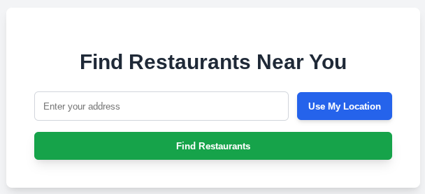
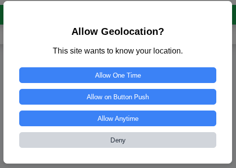
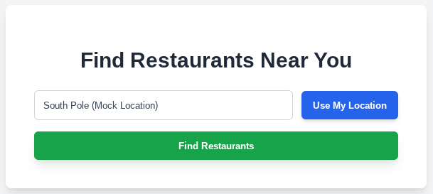

# The `<geolocation>` element \- seamless and safe user location usage

### Tl;dr

This document proposes a dedicated `<geolocation>` element to simplify location requests, as an extension to [permission elements](https://github.com/WICG/PEPC/blob/main/explainer.md). The element can directly provide location data as the user’s request directly to the site.

This document assumes familiarity with the [permission element explainer](https://github.com/WICG/PEPC/blob/main/explainer.md) and its advantages and benefits over JS API calls. The delta between the `<permission>` element and this `<geolocation>` element are:

* **Capability-Specific Design:**  The `<geolocation>` element specifically focuses on the "geolocation" capability and its APIs ([getCurrentPosition](https://developer.mozilla.org/en-US/docs/Web/API/Geolocation/getCurrentPosition), [watchPosition](https://developer.mozilla.org/en-US/docs/Web/API/Geolocation/watchPosition)). This follows the proposed direction to replace the generic `<permission>` element with a suite of individual, capability-specific elements for a more tailored and extensible platform.  
* **Data-Centric vs. State-Centric Philosophy:** The primary goal of the `<geolocation>` element is to streamline the process of sharing location information with the site, whereas the `<permission>` element was designed to facilitate the process of changing permission status. This fundamental shift in purpose leads to the following behavioral differences:
  * **Direct Data Delivery:** Because its goal is data delivery, the `<geolocation>` element includes attributes (e.g., `position`) and events (e.g., `location`) that can replace the need for a site to call the Geolocation JS API directly. The browser can handle the API call internally and provide the result to the site.  
  * **Action-Oriented Behavior in Granted State:** When the user has already granted permission, clicking the `<geolocation>` element does not trigger a permission prompt UI. Instead, it re-triggers the action: it fetches a new location and delivers it to the site, creating a simple "refresh my location" button.  
  * **Enabling a Frictionless Middle Ground:** The element is designed to facilitate a safe, one-click way for users to share their location for a specific task, without granting broader access. This "on-click" grant model, where the site only gets location when the user interacts with the button, represents a happy medium between the friction of repeated prompts and the privacy implications of a permanent grant.

### Justification

The [permission element](https://github.com/WICG/PEPC/blob/main/explainer.md) is an attempt to solve several problems when dealing with permissions on the web. However, since capabilities in general have quite different behaviors and usage patterns, a one-size-fits-all element makes the element difficult to use and hampers its potential. Recent cross-browser discussions (\[[1](https://github.com/mozilla/standards-positions/issues/1245)\], \[[2](https://github.com/w3ctag/meetings/blob/gh-pages/2025/telcons/06-16-minutes.md#design-reviews1079-page-embedded-permission-controls---martinthomson-marcoscaceres-matatk-heisenburger)\], \[[3](https://github.com/WICG/PEPC/issues/59)\]) encourage us to explore permission elements that are specifically tailored to particular capabilities.

This document proposes a `<geolocation>` element which focuses on the “geolocation” capability. The `<permission>` element would no longer be directly usable (though first we'll also need a similar `<usermedia>` element for camera/microphone as well as similar elements for other capabilities that want to make use of this pattern).

### Proposal

The `<geolocation>` element focuses on use cases which involve calling the [getCurrentPosition](https://developer.mozilla.org/en-US/docs/Web/API/Geolocation/getCurrentPosition) or [watchPosition](https://developer.mozilla.org/en-US/docs/Web/API/Geolocation/watchPosition) APIs. It has attributes which can be used to access the location directly (as a [GeolocationPosition](https://developer.mozilla.org/en-US/docs/Web/API/GeolocationPosition) object), and should \- in many cases \- remove the need to call the JS APIs directly. The element by default will behave like [getCurrentPosition](https://developer.mozilla.org/en-US/docs/Web/API/Geolocation/getCurrentPosition), providing the geolocation position on demand, once per interaction.

The `<geolocation>` element is specifically an element which makes the flow of sharing location to a site easy and seamless, when the user engages with it, while not being annoying or spammy otherwise.

#### Mock user journey

The following code and mocked UI is for illustrative purposes and are NOT MEANT to illustrate any particular user agent. Permission prompt UI and permission model details are up to the user agent.

Example code for how the `<geolocation>` element might be used:
```html
<geolocation id="geo"
             onlocation="populateAddress()"
             autolocate
             precise>
<!-- here maybe some fallback contents -->
</geolocation>
<script>
  function populateAddress() {
    let el = document.getElementById("geo");
    if (el.position !== undefined) {  
      let address = favoriteGeoLibrary.reverseGeocode(el.position).address;   
      fillInAddressField(address); 
    } else {
      handleError(el.error);
    }
  }
</script>
```
| Description | &nbsp;&nbsp;&nbsp;&nbsp;&nbsp;&nbsp;&nbsp;&nbsp;&nbsp;&nbsp;&nbsp;&nbsp;&nbsp;&nbsp;&nbsp;&nbsp;&nbsp;&nbsp;&nbsp;&nbsp;&nbsp;&nbsp;&nbsp;&nbsp;&nbsp;&nbsp;&nbsp;&nbsp;&nbsp;&nbsp;&nbsp;&nbsp;&nbsp;&nbsp;&nbsp;&nbsp;&nbsp;&nbsp;&nbsp;&nbsp;&nbsp;&nbsp;&nbsp;&nbsp;&nbsp;&nbsp;&nbsp;&nbsp;&nbsp;&nbsp;Screenshot&nbsp;&nbsp;&nbsp;&nbsp;&nbsp;&nbsp;&nbsp;&nbsp;&nbsp;&nbsp;&nbsp;&nbsp;&nbsp;&nbsp;&nbsp;&nbsp;&nbsp;&nbsp;&nbsp;&nbsp;&nbsp;&nbsp;&nbsp;&nbsp;&nbsp;&nbsp;&nbsp;&nbsp;&nbsp;&nbsp;&nbsp;&nbsp;&nbsp;&nbsp;&nbsp;&nbsp;&nbsp;&nbsp;&nbsp;&nbsp;&nbsp;&nbsp;&nbsp;&nbsp;&nbsp;&nbsp;&nbsp;&nbsp;&nbsp;&nbsp; |
| ---- | ---- |
| The blue button is the `<geolocation>` element. |  |
| User clicks on the button.  |  |
| User clicks “allow one time” and the location is retrieved.  |  |
| Some time later the user revisits the site. The previous grant has expired. The user clicks the button again.  |  |
| This time the user picks the “Allow Anytime” option, and the location is populated as before.  |  |
| Some time later the user revisits the site. Since the element uses the `autolocate` attribute, and the user had previously selected the “Allow Anytime” option, the `position` attribute is immediately populated and the `location` event is called immediately meaning that the location is immediately populated in the address field.  |  |

A [demo](https://wicg.github.io/PEPC/demo/geolocation_mock.html) is also available as a more interactive example.

#### Attributes and events:

| position | Readonly IDL-only property | A [GeolocationPosition](https://developer.mozilla.org/en-US/docs/Web/API/GeolocationPosition) object which contains the location, once it’s available. |
| :---- | :---- | :---- |
| `location` | Event | Raised when the geolocation call has been made and resolved. This is as a result of user interaction (or also automatically with the `autolocate` attribute). When the location event is raised, one and only one out of the `position` or `error` attributes should be populated. The site should look at the `position` or `error` attributes to see whether there was a successful location retrieval or some error. |
| `onlocation` | IDL property and content attribute | Event handler property for the event above. |
| `error` | Readonly IDL-only property | A [GeolocationPositionError](https://developer.mozilla.org/en-US/docs/Web/API/GeolocationPositionError) object which contains an error that has occurred when trying to obtain location. |
| `precise` | IDL property and content attribute | This attribute is the equivalent of setting the [enableHighAccuracy](https://developer.mozilla.org/en-US/docs/Web/API/Geolocation/getCurrentPosition#enablehighaccuracy) option. |
| `autolocate` | IDL property and content attribute | When specified, the user agent should try to retrieve location even without user interaction, as soon as the element is added to the DOM but only if there is already permission from the user for geolocation access. In this case the `position` (or `error`) attribute will be populated as soon as possible and the `location` event is then raised. |
| `watch` | IDL property and content attribute | When specified the element’s behavior changes to better match [watchPosition](https://developer.mozilla.org/en-US/docs/Web/API/Geolocation/watchPosition), with the `location` event being raised every time the user's position changes. |

#### Form serialization

The `<geolocation>` element should be submittable via form:

1) Add the `<geolocation>` element to the [submittable elements list](https://html.spec.whatwg.org/multipage/forms.html#category-submit)  
2) Adjust the [construct the entry list](https://html.spec.whatwg.org/multipage/form-control-infrastructure.html#constructing-the-form-data-set%20) algorithm to handle the `<geolocation>` element by including an entry with the element’s name and the value set to the return value of [JSON.stringify](https://developer.mozilla.org/en-US/docs/Web/JavaScript/Reference/Global_Objects/JSON/stringify) on the `position` attribute.

#### User agent considerations: permission models and prompts

This section is purely informative and provides some consideration for user agents’s permissions model and permission prompt:

The exact details of the scope of the grant after the user interacts with the permission prompt are left to the user agent (to decide which options to put in front of the user), and the user themselves (to pick out of the presented options). Broadly speaking there are 5 possible choices (for granting access) that user agents could consider putting in front of users when presenting a `<geolocation>` element-initiated permission prompt:

| Granting Access Options | Grant duration | include separate API usage for its duration | Next interaction on the element |
| :---- | :---- | :---- | :---- |
| **One-Shot w/ prompt\*** | location is retrieved once | FALSE | triggers prompt; next interaction \= next click |
| **One-Shot w/o prompt\*** | location is retrieved once | FALSE | does not trigger prompt; next interaction \= next click |
| **One-time w/ prompt** | location is allowed until end of the visit (classic one time) | TRUE | triggers prompt; next interaction \= next visit (after the one-time grant expires) |
| **One-time w/o prompt** | location is allowed until end of the visit (classic one time) | TRUE | does not trigger prompt; next interaction \= next visit (after the one-time grant expires) |
| **Perma grant** | location is allowed while visiting the sites (classic permanent grant) | TRUE | does not trigger any prompts |

\* (Added for completeness, though it does not appear that any user agent is considering this option)

Ultimately it's up to the user agent which of these choices to put in front of the user, and exactly how they affect the permission status (if they affect them at all). 

Possible other aspects to consider:

* The `<geolocation>` element is generally designed to still be interactable even when the permission status would otherwise deny a call like getCurrentPosition without a prompt. User agents should consider what the `<geolocation>` element should do exactly when the permission status is denied, whether the prompt should be different or the element itself should look different (for example a strike-through icon).  
* The presence of some attribute (for example the `watch` or `autolocate` attributes) might be used by user agents to alter their permission prompts. For example: if the `autolocate` attribute is not present, the permanent grant option could not be part of the prompt, or if the `watch` attribute is present the text of the permission prompt could be used to reflect this.  
* If clicked when the permission element is granted, the [permission element](https://github.com/WICG/PEPC/blob/main/explainer.md#designing-the-permission-ui) proposal suggests triggering permission prompts which allow revoking the permission status. For the `<geolocation>` element, user agents should consider instead simply fetching location again directly.

#### User agents considerations: handling revocation
In principle permission regret (a user wishing to undo a previous permission decision) can fall under 2 categories:

* Regretting blocking a capability 
* Regretting allowing a capability (revocation)

While these essentially stem from the same root cause, addressing them requires different approaches since there are significant differences, and especially: the impact on the user (annoyance or being unable to complete a task vs a security/privacy risk), and the willingness of the site itself to help (interested vs neutral/actively disinterested), etc. Because of this it’s not reasonable to expect the same solution to work for both categories.

The initial `<permission>` element focused mostly on regretting blocking a capability. While it did also try to help with revoking permissions (see [UI When Permission is Already Granted](https://github.com/WICG/PEPC/blob/main/explainer.md#designing-the-permission-ui)), it was ultimately dependent on the site’s cooperation (keeping it in the page after the permission was granted). However, based on Chrome's Origin Trial experience this is unlikely to happen: sites often remove the permission element after the permission is granted, or they simply don't show it when permission is already granted. Meaning that both the `<permission>` element and now the `<geolocation>` element are poorly positioned to help with revoking permissions. Instead the existing UI surfaces and indicators (usually called "usage indicators") at the browser, OS and sometimes even device level, should continue to be used and improved.

Ultimately the `<geolocation>` element is no longer designed as an element that help with managing permission status, rather an element which helps users safely send their location to the site if they wish to, without being intrusive if they don't. Just like the equivalent API, if this also involves requesting permission from the user, the browser should handle that (and now with the added strong signal of user intent).

However there are still aspects that browsers might consider exploring here, for example:
* A simple heuristic of users clicking the button repeteadly in quick succession might indicate a frustration with the current status and an opportunity to open the relevant settings UI where the user can alter the permission status.
* Adding animation to the `<geolocation>` element while the location is being sent can help clarify behavior, especially if `autolocate` is present.

#### Comparison Overview: Geolocation Handling Models

This table compares three different models for handling geolocation permissions. It contrasts the status quo (how sites currently access location via JavaScript) with two evolving proposals for a Page-Embedded Permission Control (PEPC, [see explainer](https://github.com/WICG/PEPC/blob/main/explainer.md)) element: an initial model focused on managing permission state and the latest proposal where the browser directly provides location data.

| Dimension | 1\. Current Handling  | 2\. "Current" PEPC Proposal (`<permission>`) | 3\. "New" PEPC Proposal (`<geolocation>`) |
| :---- | :---- | :---- | :---- |
| **Triggering Event for Permission Prompt**  | A script on the site calls one of the navigator.geolocation JS APIs. | The user clicks on the browser-controlled `<permission>` element. | The user clicks on the browser-controlled `<geolocation>` element. |
| **Browser's Primary Role** | Decides whether to show a permission prompt based on the permission state, and provides the location data. The site decides on timing. | Acts as a **permission manager**. The browser shows a prompt and then notifies the site that a decision has been made. The user decides on the prompt timing. | Acts as a **data mediator**. The browser shows a prompt, gets the location itself, and then passes the data directly to the site often without a need to call the JS API. The user decides on prompt timing. |
| **Site's Responsibility** | Call the JS API and handle the success/error callbacks. | Listen for the element's event, check if permission was granted using Permissions API, and **then call the JS Geolocation API itself**. | Listen to the location event from the element. **No JS API call is needed (in most cases).** |
| **How Site Gets Location Data** | As an argument in the success callback of the JS API call. | By making a separate JS API call *after* the PEPC flow is complete. | **Directly from a property on the `<geolocation>` element** (`position`) |
| **Core Goal of the Mechanism** | To enable basic access to the Geolocation API. | To **manage permission state** and solve "permission regret" (the perma-block problem). | To **streamline sharing location data** safely and simply, while also solving permission regret. |
