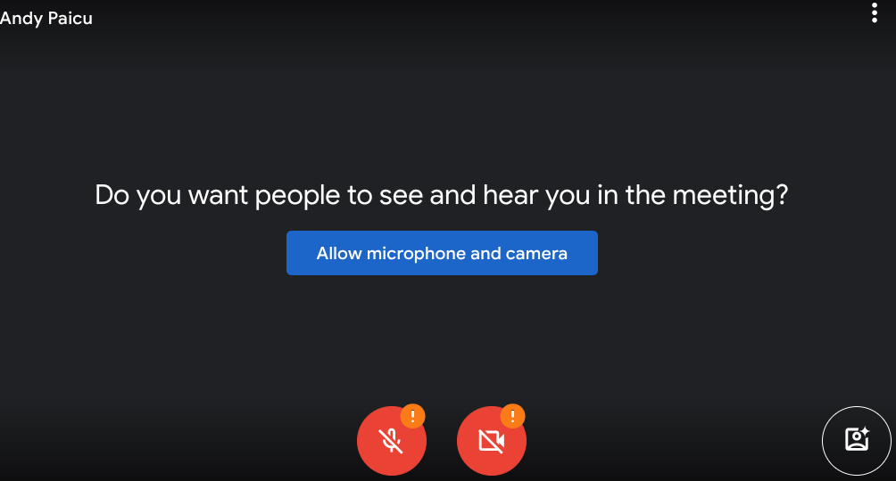
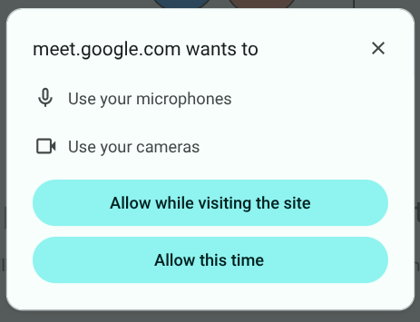
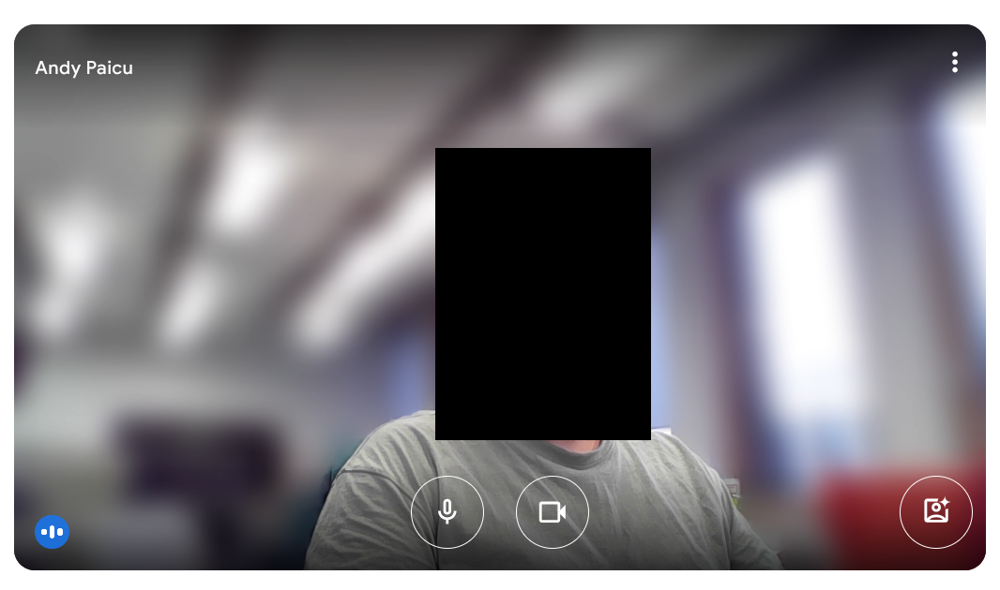
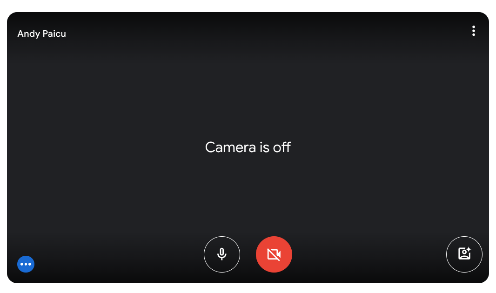
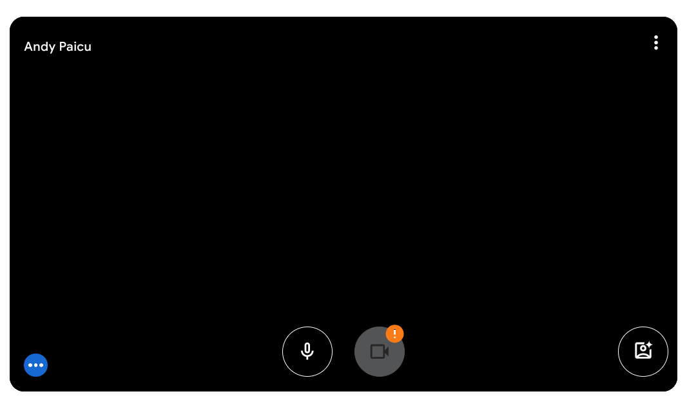
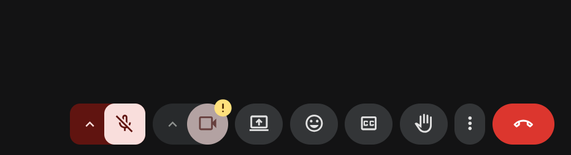
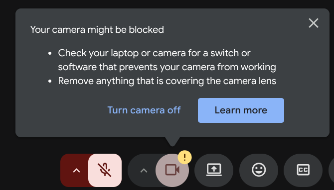
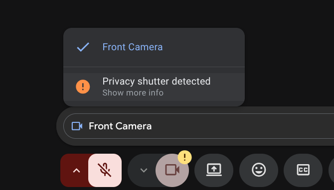

# `<usermedia>` element

## TL;DR

The `<usermedia>` element is focused on use cases that involve API calls to [`getUserMedia`](https://developer.mozilla.org/en-US/docs/Web/API/MediaDevices/getUserMedia) and it replaces the `<permission>` element with the type `camera` or `microphone` (or both). It’s designed so that it can initiate the process of obtaining the `MediaStream` solving the problems that the permission element solves, while then being useful as a UI element to mute/unmute said stream.

This document assumes familiarity with the [permission element explainer](https://github.com/WICG/PEPC/blob/main/explainer.md) and its advantages and benefits over JS API calls. 

The `<usermedia>` element’s core functionality is related to its `stream` property:

* When there is no `stream` set, clicking on the element will attempt to start a stream by making a [`getUserMedia`](https://developer.mozilla.org/en-US/docs/Web/API/MediaDevices/getUserMedia) call (which might involve a permission prompt). If successful the `stream` is then set to reference the resulting `MediaStream`.  
* When there is a `stream` set, clicking on the element will mute/unmute the stream by setting the underlying stream tracks’ `enabled` property.

## User journey (Meet \+ Chrome used as the example)

This journey exemplifies the functionality needed by the `<usermedia>` element. The screenshots are taken with Chrome in Meet but other conferencing platforms \+ browser combinations would exemplify the same conclusions. We’re assuming that we are in the ideal world where the relevant UI elements have already been replaced with `<usermedia>` elements.

| Current journey step | Action being taken to progress |
| :---- | :---- |
| All permission statuses are `prompt`:  | Click on one of the 3 `<usermedia>` elements (in this example the blue button) |
| A permission prompt is shown  following the blue button click:  Analogous: Click on microphone/camera shows a permission prompt for the respective capability | Allow permission.  This also starts the camera/microphone streams so on the next step my camera is showing and my microphone is recording. |
| Stream starts:  | Click on the icon-only `<usermedia>` element (the camera icon button).  |
| Stream is muted:  | Click on element again.   |
| Stream is resumed:   |  |

|Some days later||
| :---- | :---- |
| Camera is allowed, the stream has started automatically without direct user interaction. The camera icon-only button in this example indicates that something is wrong (green room or in-call):   | Click on "exclamation mark” badge  |
| A dialog explains the situation (in-page):  | Close the notice  |
| Camera is still covered:  | Click on arrow next to it since I want a different camera  |
| A camera selection dropdown allows me to pick camera (in my case I only had 1 camera, but pretend there are 2):  | Pick a different camera |
| Stream is started with the new camera:  |  |

Key functionality of the current user journey, that should equally work for a `<usermedia>` element.

1) **The `<usermedia>` element should handle starting the stream on its own.** This means that there should be a way for developers to specify the `gUM` call constraints. (`gUM` \= [getUserMedia](https://developer.mozilla.org/en-US/docs/Web/API/MediaDevices/getUserMedia), the API used to start camera/microphone streams)  
2) A stream started by an `<usermedia>` element should be able to be **muted/unmuted** by clicking the element again.  
3) Flexibility should still allow developers to call `gUM` separately (e.g. to change camera). **A stream should be able to be associated** with an `<usermedia>` element such that even if it’s not started from the element itself, it can then be controlled from the element (to support flows such as switching the input device or starting the streams via the “blue button”).  
4) The status quo UI elements often have a **clickable badge** over the button which can be clicked to show more information when something is wrong. Providing this badge functionality is probably reasonable, at the `<permission>` element level.  
5) On subsequent visits, if the permission state allows it, the **stream should be able to start automatically**.

## Constraints

[The permission element explainer](https://github.com/WICG/PEPC/blob/main/explainer.md#specifying-capability-constraints-for-the-permission-element) suggests 5 options of specifying constraints. These constraints will be applied to the `gUM` call that the `<usermedia>` element initiates when it needs to start a MediaStream object. We will assume in this document and examples that [option 1](https://github.com/WICG/PEPC/blob/main/explainer.md#option-1-inline-script-with-typepermissionconstraints) is used for specifying constraints, but any of the outlined approaches would work just fine.

### Type

In the `<permission>` element we have the [`type`](https://github.com/WICG/PEPC/blob/main/explainer.md#technical-specification) attribute which can be used to specify whether the element is `camera`/`microphone`/both (or other types like `geolocation`). For the `<usermedia>` element we will make use of the fact that it has constraints to determine what kind of element it is. **Based on the presence of the [video and audio](https://developer.mozilla.org/en-US/docs/Web/API/MediaDevices/getUserMedia#constraints) properties in the constraints,** the element is considered to be audio-only/video-only/audio-video.

```html
<!-- this is a video-only element -->
<usermedia>
<script type="permissionconstraints">
  {
    "video": {
      "width": { "min": 640, "ideal": 1920, "max": 1920 },
      "height": { "min": 400, "ideal": 1080 },
      "aspectRatio": 1.777777778,
      "frameRate": { "max": 30 }
    }
  }
</script>
</usermedia>

<!-- this is an audio-only element -->
<usermedia>
<script type="permissionconstraints">
  {
    "audio": {
      "sampleSize": 16,
      "channelCount": 2
    }
  }
</script>
</usermedia>

<!-- this is an audio-video element -->
<usermedia>
<script type="permissionconstraints">
  {
    "video": {
      "width": { "min": 640, "ideal": 1920, "max": 1920 },
      "height": { "min": 400, "ideal": 1080 },
      "aspectRatio": 1.777777778,
      "frameRate": { "max": 30 }
    },
    "audio": {
      "sampleSize": 16,
      "channelCount": 2
    }
  }
</script>
</usermedia>
```

If there are no constraints or they don’t contain truthy values for either audio or video, then the element is considered invalid (treated the same as if it was a `<permission>` element today with an invalid `type` attribute specified).

## MediaStream integration

The heart of the `<usermedia>` element is its `stream` property; this property holds a [MediaStream](https://developer.mozilla.org/en-US/docs/Web/API/MediaStream) object reference. This is the `MediaStream` object that this `<usermedia>` element controls, and it can be automatically populated when the user interacts with the element, or set programmatically if the `MediaStream` object was obtained in a different way (e.g. interaction with a different `<usermedia>` element, or changing the input device via some UI).

The `MediaStream` object which is referenced by the `stream` property is called the “associated `MediaStream`”. The [MediaStreamTrack](https://developer.mozilla.org/en-US/docs/Web/API/MediaStreamTrack)s from the associated `MediaStream` which are relevant to the `<usermedia>` element (based on whether it’s audio/video/both), are called the “associated tracks”.

1) If the user clicks the `<usermedia>` element which has no associated `MediaStream` or for which the [MediaStream.active](https://developer.mozilla.org/en-US/docs/Web/API/MediaStream/active) property is `false`: the browser will start a `gUM` call with the [constraints specified](#constraints) (which might often involve a permission prompt). If successful the `stream` property will be set to the returned `MediaStream` object and the `streamready` event will be raised. Developers can use this `stream` property as they normally would use a `MediaStream`.

   Example:

```html
<video id="stream-playback" autoplay></video> 
<!-- The element which will hold the stream playback which is shown to the user -->
...
<usermedia onstreamready="streamStarted()" id="blue-um">
<script type="permissionconstraints">
{...} // Some video+audio reasonable constraints.
</script>
</usermedia>

<script>
function streamStarted() {
  var el = document.getElementById("blue-um");
  if (el.error) {
    handleError(el.error);
    return;
  }

  // provide the stream reference to the video element so that stream playback
  // can start. 
  var videoEl = document.getElementById("stream-playback");
  videoEl.src = el.stream; 
}
</script>
```

2) If the user clicks an `<usermedia>` element while it has an active associated `MediaStream` then this will result in muting/unmuting the associated tracks (based on the current status of the `enabled` property).

   The `enabled` property is automatically calculated by aggregating the values of the associated tracks’s [enabled](https://developer.mozilla.org/en-US/docs/Web/API/MediaStreamTrack/enabled) properties: if any of the associated tracks has an [enabled](https://developer.mozilla.org/en-US/docs/Web/API/MediaStreamTrack/enabled) value of `true` then the `enabled` property for the whole element is `true`. Otherwise it is `false`. The `enabled` property can also be set by developers to programmatically mute/unmute all associated tracks.

   Since this is not a sensitive operation, **the `<usermedia>` element is automatically considered valid** (see `isValid` from [permission element explainer](https://github.com/WICG/PEPC/blob/main/explainer.md#developer-integration-and-best-practices)) **if it has an associated active `MediaStream`**. This affords some flexibility: for example the transparent background that is on the “mute/umute” icons when the video stream is started.

3) Developers can set the `stream` property so that the element will have an associated `MediaStream` which has been obtained **not** from interaction with this element. This allows, for example, to associate the `MediaStream` obtained by clicking the blue `<usermedia>` element in the screenshot, to the mute/unmute icon-only elements so that when the user clicks on the icon-only elements, they will mute the existing stream instead of starting a new one.

   
  
   Associating a stream that has no relevant tracks for the element type will be allowed but user agents might consider showing a console warning. E.g. associating a `MediaStream` with only “video” track(s) to a `<usermedia>` element that is audio-only will function, but it will not be very useful.

### Attributes and events

This is the table of proposed attributes and events

| `stream` | `MediaStream` Property | The associated stream. |
| :---- | :---- | :---- |
| **`autostart`** | **Boolean Attribute** | **Should try to start the stream automatically as the element is added to the DOM.** |
| `streamready` | Event | Raised when a stream is ready from user interaction. |
| `enabled` | Boolean Property | Reads the current mute/unmute state. Can be set to mute/unmute the stream programmatically. |
| `userchangedenabled` | Event | Raised when the user has changed the `enabled` property state by interacting with the element. |

## Text/icon changes based on stream state

There are 3 possible states that the element could be in:

1) Inactive: an `<usermedia>` element which has no associated `MediaStream` or for which the [MediaStream.active](https://developer.mozilla.org/en-US/docs/Web/API/MediaStream/active) property is false  
2) Active: opposite of above, further broken down into:  
   1) Enabled: an element for which the `enabled` property is `true` (aka it is currently streaming).  
   2) Disabled: an element for which the `enabled` property is `false` (aka it is currently paused).

User agent should consider which icon and text to set based on this state, for example:

|  | Audio-only | Video-only | Audio-video |
| :---- | ----- | ----- | ----- |
| Inactive | Normal microphone icon “Use camera” | Normal camera icon “Use microphone” | Normal camera icon “Use microphone and camera” |
| Enabled | Normal microphone icon“Mute camera” | Normal camera icon “Mute microphone” | Normal camera icon “Mute microphone and camera” |
| Disabled | Strikethrough microphone icon “Umute camera” | Strikethrough camera icon “Unmute microphone” | Strikethrough camera icon “Unmute microphone and camera” |

Additionally, to allow for easier styling, a `disabled` CSS pseudo-class \*could\* be introduced which allows for different styling when the element is in the “disabled” state. This seems like a nice-to-have, since the same functionality can be accomplished in other ways.

## Icon only \+ badge

In order to replace the current UI elements, especially the mute/unmute buttons we also have 2 features that need to be implemented at the base `<permission>` element level:

1) Icon-only `<permission>` elements  
2) Badges

These dependencies are not part of the proposal as they would be separate proposals for the base `<permission>` element instead.

